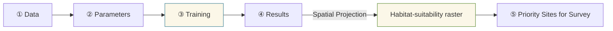

# The Analysis dock

The QMaxent Analysis dock is the heart of the plugin. It organises the entire
SDM workflow into **five numbered tabs** that you progress through in order,
left to right. This chapter is a quick tour of the layout; each tab then has
its own detailed chapter.

## Opening the dock

Choose **Plugins → QMaxent → QMaxent Analysis**. The dock opens on the right
side of the QGIS main window by default and can be detached, floated, or
re-docked using the standard QGIS panel handles.

## The five tabs at a glance

| # | Tab | What you do here |
|---|---|---|
| ① | **Data** | Choose the species (presence-point layer) and environmental rasters; check that everything aligns |
| ② | **Parameters** | Pick Maxent feature types, regularization, spatial cross-validation method, and output paths |
| ③ | **Training** | Watch the model fit; read the log for AUC, jackknife results, and any warnings |
| ④ | **Results** | Inspect response curves, jackknife variable importance, and run spatial projection |
| ⑤ | **Priority Sites for Survey** | Generate field-ready candidate sites from a trained model |

The numbered prefix is intentional — it signals the order. You cannot use
the **Results** tab before **Training** has completed, and **Priority Sites**
needs a finished projection raster.

## Status bar and Run buttons

Two elements stay fixed regardless of which tab is active:

- The **status bar** at the bottom-left summarises the current model state
    (e.g. `presence=116 background=10,113 train AUC=0.9562 CV AUC=0.7581`).
    Empty before training; populated after.
- The big **▶ Run Maxent** button at the bottom-right kicks off the full
    training+evaluation pipeline. Clicking it switches focus to the Training
    tab automatically.

## Loading an existing model

Sometimes you want to reuse a model you trained earlier rather than start
from scratch. The **Load existing model (.pkl)…** button at the top right of
the **Data** tab opens a dialog that re-hydrates a saved Maxent model and
asks you to map each model variable to a current QGIS raster layer. See
[Saving and reusing models](saving-models.md) for the full workflow and the
security note on pickle files.

## A typical workflow

The next five chapters take each tab in turn.
