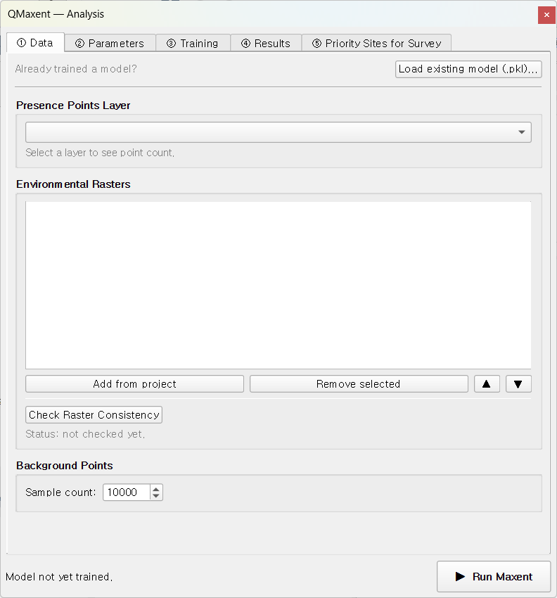

# The Analysis dock

The QMaxent Analysis dock is the heart of the plugin. It organises the entire
SDM workflow into **five numbered tabs** that you progress through in order,
left to right. This chapter is a quick tour of the layout; each tab then has
its own detailed chapter.

## Opening the dock

Choose **Plugins → QMaxent → QMaxent Analysis**. The dock opens on the right
side of the QGIS main window by default and can be detached, floated, or
re-docked using the standard QGIS panel handles.

## The five tabs at a glance

| # | Tab | Purpose | Detailed chapter |
|---|---|---|---|
| ① | **Data** | Pick presence layer; register environmental rasters; pre-flight raster grid check | [① Data tab](data-tab.md) |
| ② | **Parameters** | Choose feature classes, regularization, spatial CV scheme, output paths | [② Parameters tab](parameters-tab.md) |
| ③ | **Training** | Live progress bar and log while the model fits | [③ Training tab](training-tab.md) |
| ④ | **Results** | Response curves, Jackknife importance, spatial projection | [④ Results tab](results-tab.md) |
| ⑤ | **Priority Sites for Survey** | Turn the prediction into field-ready candidate points | [⑤ Priority Sites](priority-sites.md) |

The numbered glyphs are deliberate: even when QGIS is configured in a
language other than English, the order is unambiguous.

## Status bar

A persistent **status bar at the bottom of the dock** shows the most
recent run summary — presence count, background count, training AUC, and
CV AUC. It is updated continuously as you click around, so you can switch
projects or reopen QGIS and immediately see whether the dock is showing a
fresh state or a previous run's results.

## Persistence across QGIS sessions

QMaxent remembers your last-used presence layer, raster set, parameter
values, and output paths inside the QGIS project file (`.qgz`). When you
reopen a project, the dock reflects the previous state — no need to
re-pick layers each time.

## Buttons across the bottom

The footer of the dock has three persistent buttons:

- **▶ Run Maxent** — start a training run
- **▶ Run Spatial Projection** — apply the trained model across all rasters
- **▶ Extract Priority Sites** — sample candidate survey locations from
  the prediction

These buttons are **enabled only when their prerequisites are met**: e.g.
projection becomes available only after a model has been trained, and the
priority-sites extractor requires a projection raster on disk.

## What this means for your workflow

The dock's design encodes the canonical Maxent workflow described in
[Elith et al. 2011](references.md): assemble inputs → choose
hyperparameters → fit → evaluate → project → act. By making each stage a
separate tab with its own status, QMaxent forces a discipline that helps
catch the silent failures
[Roberts et al. 2017](references.md) and
[Araújo et al. 2019](references.md) warn about — particularly raster
mismatch and over-optimistic AUCs from non-spatial CV.
