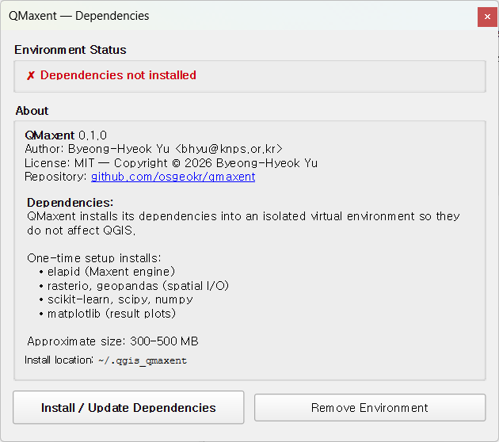
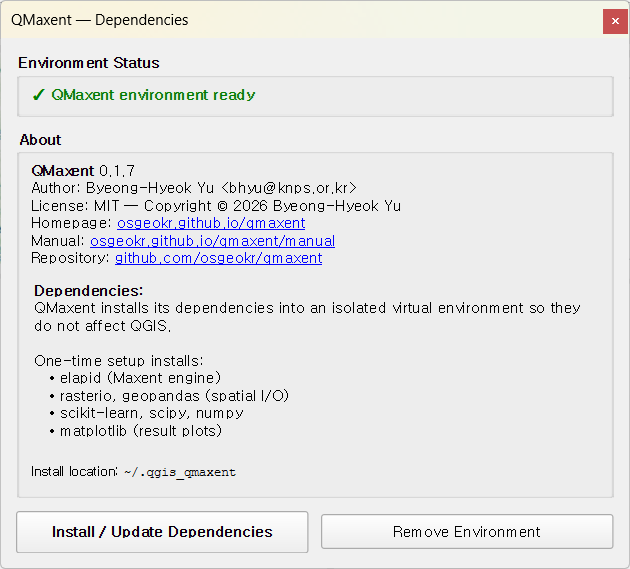

# Dependencies

QMaxent's modeling engine — the
[elapid](https://github.com/earth-chris/elapid) Python library and its
companions ([rasterio](https://rasterio.readthedocs.io/),
[geopandas](https://geopandas.org/),
[scikit-learn](https://scikit-learn.org/),
[matplotlib](https://matplotlib.org/)) — does not ship with QGIS. The
first time you use the plugin, you install these dependencies into an
**isolated, per-plugin virtual environment** so they do not affect your
system Python or QGIS itself.

This is a one-time, ~5-minute setup.

## Opening the Dependencies dialog

Choose **Plugins → QMaxent → QMaxent Dependencies**.

The dialog reports the current state of the QMaxent virtual environment,
the plugin version, and a summary of what will be installed.

## Environment Status panel

The status banner at the top tells you exactly what to do:

| Banner | Meaning |
|---|---|
| ✗ **Dependencies not installed** | First-time setup needed (the case above) |
| ✓ **QMaxent environment ready** | Everything is installed and ready to model |
| ⚠ **Update available** | New version of one or more dependencies recommended |

## Install / Update Dependencies

Click **Install / Update Dependencies**. The plugin downloads the
packages from [PyPI](https://pypi.org) into the path shown at the bottom
of the dialog (default: `~/.qgis_qmaxent` on macOS/Linux,
`%USERPROFILE%\.qgis_qmaxent` on Windows). Total download is approximately
**300–500 MB** depending on your platform; allow 3–8 minutes on a typical
broadband connection.

When the installer finishes, the status banner turns green:

You can now close the dialog and open **QMaxent Analysis** — the modeling
workflow is unlocked.

## What is installed

QMaxent installs the following packages and their transitive dependencies:

- **[elapid](https://github.com/earth-chris/elapid)** — the Maxent engine
    (maxnet algorithm, spatial cross-validation, projection); see
    Anderson (2023).
- **[rasterio](https://rasterio.readthedocs.io/)** — raster I/O.
- **[geopandas](https://geopandas.org/)** — vector I/O for presence
    points.
- **[scikit-learn](https://scikit-learn.org/)** — cross-validation, ROC,
    AUC; see Pedregosa et al. (2011).
- **[scipy](https://scipy.org/)** + **[numpy](https://numpy.org/)** —
    numerical core; see Harris et al. (2020).
- **[matplotlib](https://matplotlib.org/)** — response curves, ROC,
    jackknife plots.

These are pinned to versions that QMaxent has been tested against; the
plugin's release notes record which versions ship with each release.

## Remove Environment

Use **Remove Environment** to delete the entire QMaxent virtual
environment from disk. You might do this to free disk space, force a
fresh re-install when something is broken, or switch to a different
QMaxent version that pins different package versions.

After removal, the status banner returns to *Dependencies not installed*
and **Install / Update Dependencies** becomes available again.

## Troubleshooting

??? warning "Installation fails with a network or SSL error"
    Most often this is a corporate proxy or firewall blocking
    [PyPI](https://pypi.org). Ask your administrator to allow `pypi.org`
    and `files.pythonhosted.org`. The installer respects QGIS's proxy
    settings, so configuring those in **Settings → Options → Network**
    usually fixes it.

??? warning "Disk space exhausted during install"
    The installer needs roughly twice the final size as scratch space
    while extracting wheels. Free at least 1 GB on the drive that holds
    your home directory before retrying.

??? warning "“No module named …” after a successful install"
    Restart QGIS once. Python's import cache occasionally needs a clean
    process to pick up the new environment.

??? warning "Plugin starts but Run Maxent button is disabled"
    Open the **Dependencies** dialog and confirm the status is green. If
    it is, restart QGIS; if it is not, click **Install / Update
    Dependencies** again.

## Security note on the virtual environment

QMaxent's environment is created with the standard Python `venv` module
and populated only from PyPI. The plugin does not execute arbitrary code
from remote sources at runtime. Saved-model files (`.pkl`) are a separate
concern; see [Saving and reusing models](saving-models.md) for the
security note on loading pickle files from untrusted sources.
