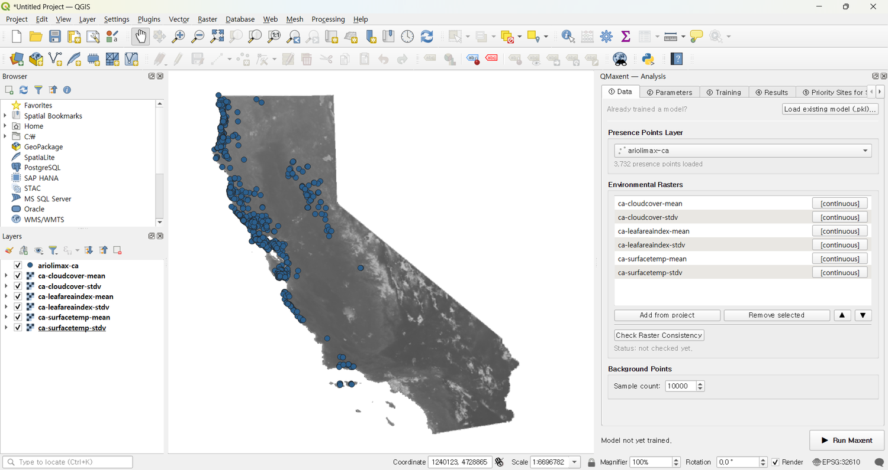
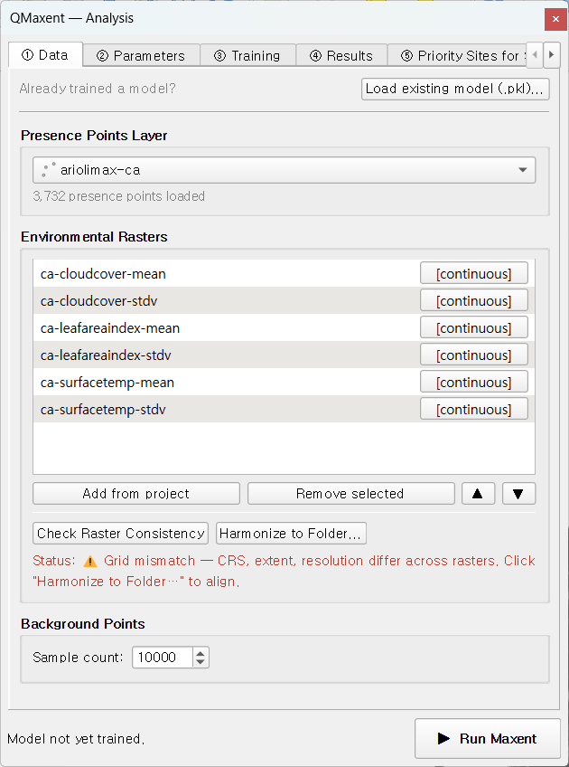
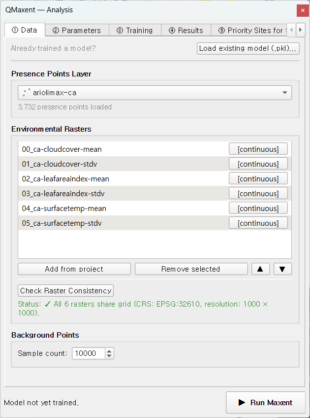

# Ariolimax

The Pacific banana slug *Ariolimax columbianus* is the second worked example.
Its purpose is different from Bradypus's feature tour — this dataset is
deliberately *messy*: the supplied environmental rasters do **not** share a
common CRS, extent, or resolution. The example walks through QMaxent's
**Check Raster Consistency** preflight and **Harmonize to Folder…** workflow,
showing the failure mode you would otherwise hit silently and the one-click
fix that makes the data Maxent-ready.

## Dataset

The Ariolimax dataset is the default that ships with
[elapid](https://github.com/earth-chris/elapid). After running
**Plugins → QMaxent → Download Example Dataset → Ariolimax**, the layers
appear on the QGIS canvas spanning California's coastal range. Presence
points are coloured blue:

Visually the data already looks unified. The raster tiles, however, were
authored by different remote-sensing pipelines and inherit different
projections and resolutions — exactly the situation that breaks Maxent
silently.

## The mismatch problem

Open **Plugins → QMaxent → QMaxent Analysis**. On **① Data**, choose the
`ariolimax-ca` presence layer (3,732 points), then **Add from project** to
register every loaded raster. Click **Check Raster Consistency**:

The status line turns amber and reports:

> ⚠ Grid mismatch — CRS, extent, resolution differ across rasters.
> Click "Harmonize to Folder…" to align.

Crucially, **the Run Maxent button is not blocked** — Maxent itself would
still produce numbers. Those numbers, however, would be silently wrong:
covariates would be sampled from the cells *nominally* underneath each
presence point but actually belonging to misaligned rasters. This is the
single most common silent-failure mode in operational SDM and the entire
reason this preflight exists.

## Running Harmonize to Folder…

A new button appears next to **Check Raster Consistency** as soon as a
mismatch is detected: **Harmonize to Folder…**. Click it and choose an
output directory. QMaxent picks the **highest-resolution** raster as the
reference grid, reprojects every other raster to that grid using
[`gdalwarp`](https://gdal.org/programs/gdalwarp.html) under the hood
(nearest-neighbour for categoricals, bilinear for continuous), and writes
new GeoTIFFs into the chosen folder. The new files are auto-loaded into
the project and the old ones are removed from the QMaxent raster list.

The Data tab refreshes to show the harmonized stack:

The status line is now green:

> ✓ All 6 rasters share grid (CRS: EPSG:32610, resolution: 1000 × 1000).

Note the file-name convention: harmonized rasters get a `00_`, `01_`, …
prefix that locks their order. This survives a `.qgz` save+reload cycle —
the model variable order is part of the model's identity, and the prefix
makes that order visible at file-system level too.

## Running the model

With the stack harmonized, the rest of the workflow is identical to
[Bradypus](bradypus.md). Accept the defaults on **② Parameters**, click
**▶ Run Maxent**, and let the training complete. The 5-fold ROC curve
shows healthy separation between training and CV performance:

The jackknife panel confirms which environmental variables carry the
species' signal:

`05_ca-surfacetemp-stdv` (variability of land-surface temperature) carries
the strongest univariate signal — biologically sensible for an organism
whose activity windows depend on cool, moist microclimates. The
mean-temperature variable has lower stand-alone power but matters when
removed (the *without* bar drops), which is the signature of a variable
that contributes information not redundant with the others.

The full set of marginal response curves shows the partial dependence of
predicted suitability on each variable across its training range:

## Comparing models with and without harmonization

We strongly recommend running this once on the *unharmonized* stack as a
teaching exercise. With Maxent's permissive raster handling you will get a
finished model and a finished AUC, but the AUC will typically be 0.05–0.10
higher than the harmonized run — *not because the model is better*, but
because covariate misalignment introduces spurious patterns that the model
fits to. The cross-validation gap (training vs. CV AUC) widens
correspondingly. Always run **Check Raster Consistency** before drawing
conclusions.

## Priority sites for survey

After projection, switch to **⑤ Priority Sites for Survey**, choose
**Discovery** mode, and extract candidates. The sites land on the same
coastal mountain ranges that the suitability map highlighted, and survey
teams can take the resulting GeoPackage straight to the field:

## What this example demonstrates

1. **The silent-failure mode of Maxent** when rasters disagree, and
2. **QMaxent's preflight + harmonize tooling** that turns a project-killing
    mistake into a one-click fix.

Carry the same habit into your own work: every time you assemble a new
raster stack, run Check Raster Consistency *before* training. If it
fails, harmonize first, train second.
