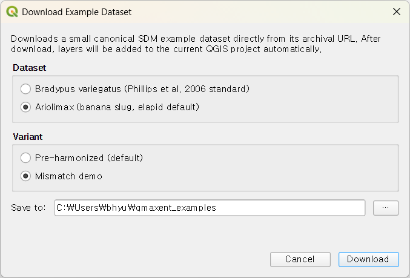
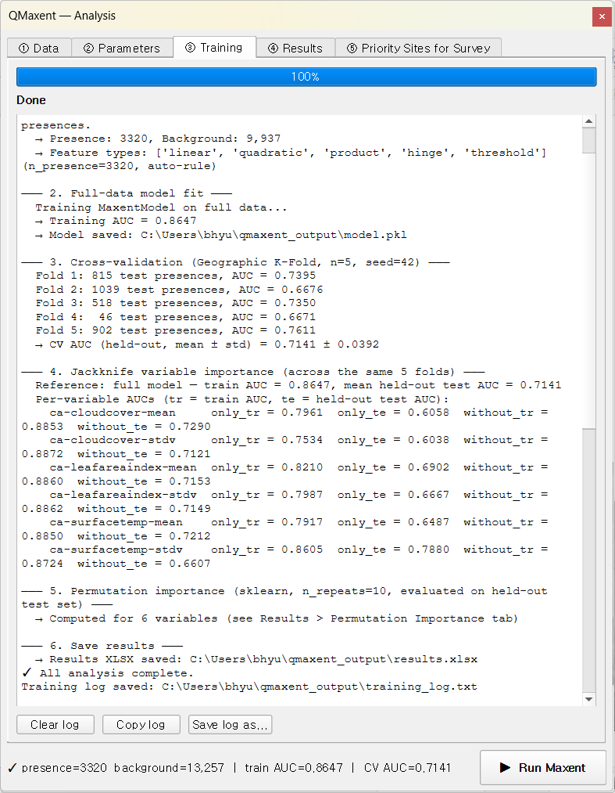
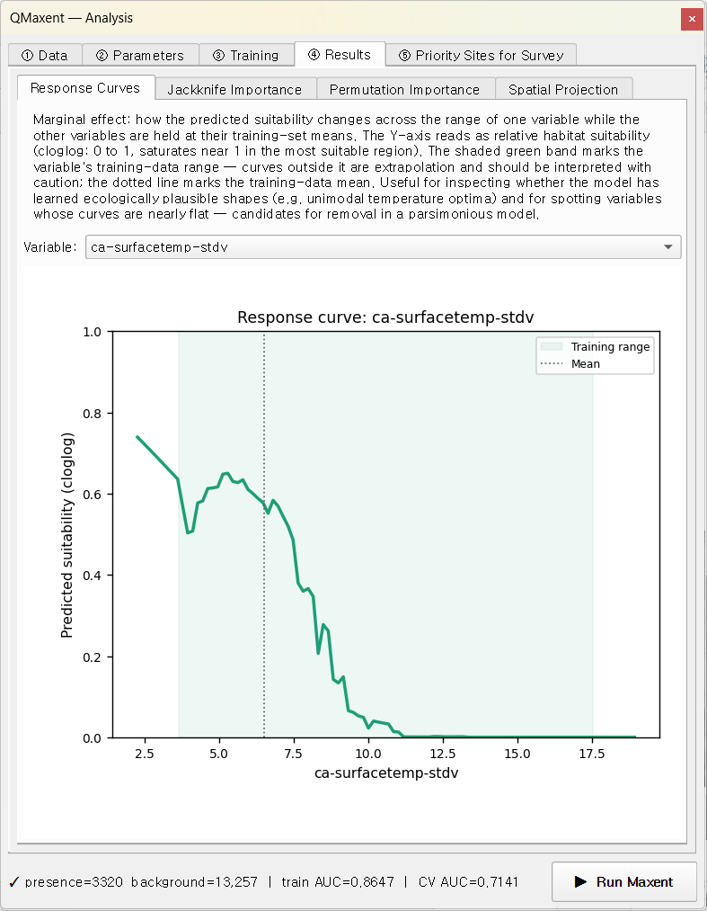
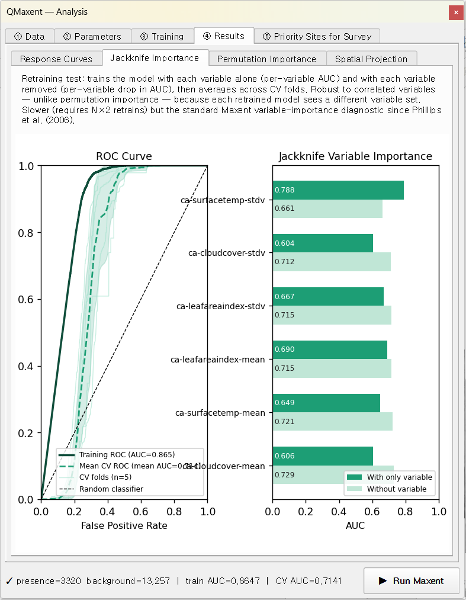
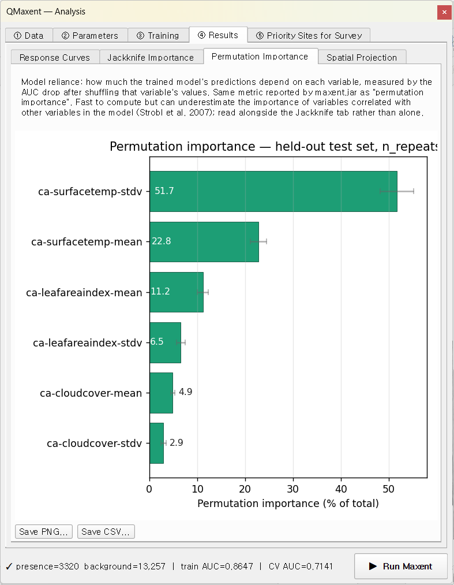
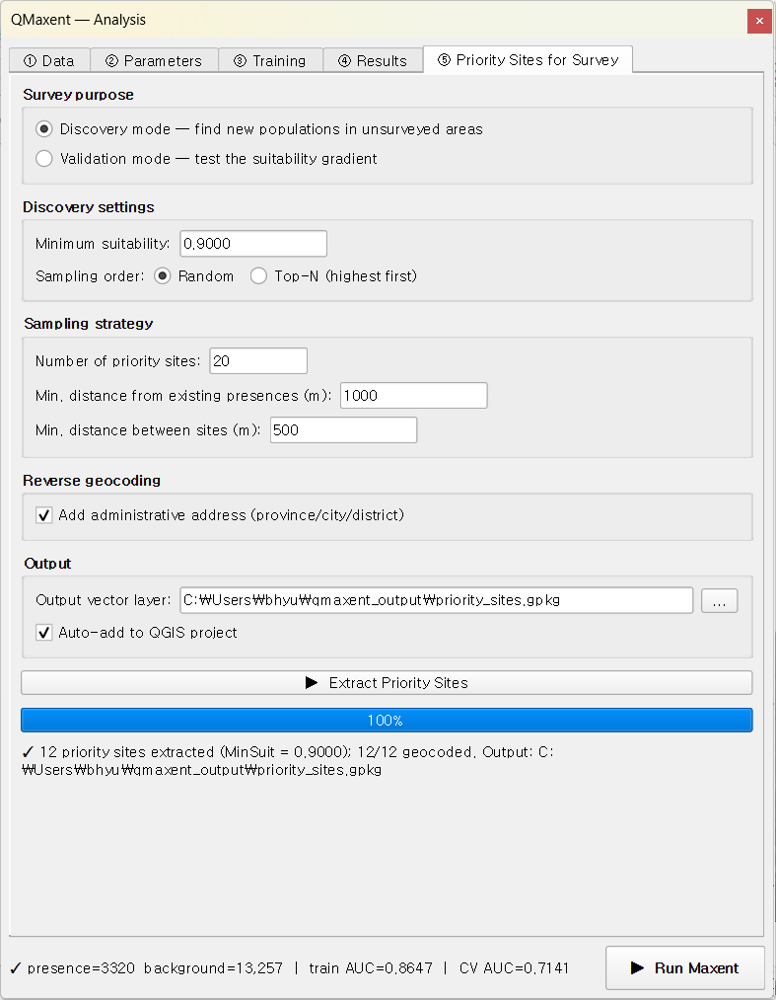
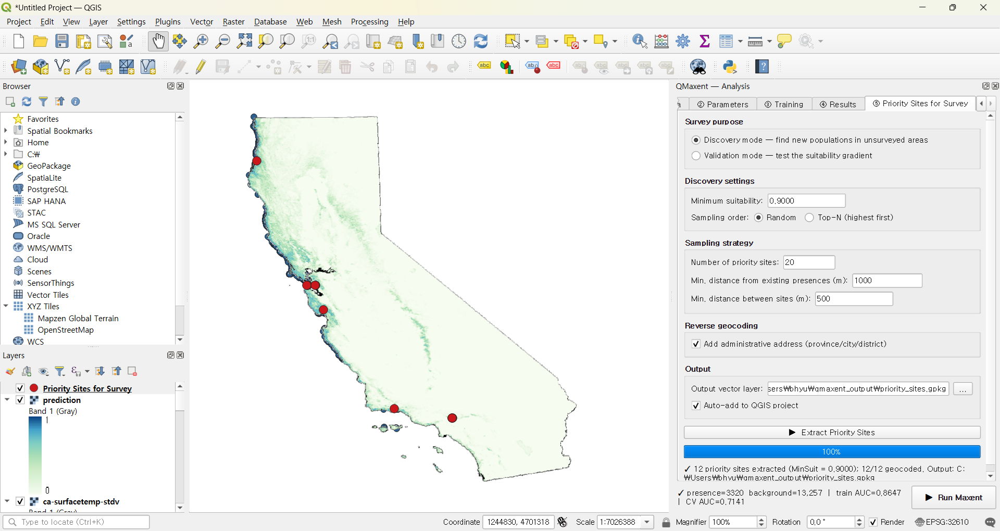

# Ariolimax

The Pacific banana slug *Ariolimax columbianus* is the second worked
example. Its purpose is different from Bradypus's feature tour — this
dataset is deliberately *messy*: the supplied environmental rasters
do **not** share a common CRS, extent, or resolution. The example
walks through QMaxent's **Check Raster Consistency** preflight and
**Harmonize to Folder…** workflow, showing the silent-failure mode
you would otherwise hit and the one-click fix that makes the data
Maxent-ready.

## 1. Dataset

The Ariolimax dataset is the default that ships with
[elapid](https://github.com/earth-chris/elapid). It comes in two
variants chosen via the **Download Example Dataset** dialog:

- **Pre-harmonized (default)** — the same six rasters already
  reprojected and resampled onto a common grid. Use this if you want
  to jump straight to model fitting.
- **Mismatch demo** — the *original* tiles with their original CRS,
  extent, and resolution intact. Use this if you want to exercise the
  Check + Harmonize tooling.

This walkthrough uses the **Mismatch demo** variant. After clicking
**Download**, the layers appear on the QGIS canvas spanning
California's coastal range:

Visually the data already looks unified. The raster tiles, however,
were authored by different remote-sensing pipelines and inherit
different projections and resolutions — exactly the situation that
breaks Maxent silently.

## 2. The mismatch problem

Open **Plugins → QMaxent → QMaxent Analysis**. On **① Data**, choose
the `ariolimax-ca` presence layer (3,732 points), then **Add from
project** to register every loaded raster (six in total —
`ca-cloudcover-mean`, `ca-cloudcover-stdv`, `ca-leafareaindex-mean`,
`ca-leafareaindex-stdv`, `ca-surfacetemp-mean`, `ca-surfacetemp-stdv`).
Click **Check Raster Consistency**:

The status line turns amber and reports:

> ⚠ Grid mismatch — CRS, extent, resolution differ across rasters.
> Click "Harmonize to Folder…" to align.

Crucially, **the Run Maxent button is not blocked** — Maxent itself
would still produce numbers. Those numbers, however, would be silently
wrong: covariates would be sampled from the cells *nominally*
underneath each presence point but actually belonging to misaligned
rasters. This is the single most common silent-failure mode in
operational SDM and the entire reason this preflight exists.

## 3. Running Harmonize to Folder…

A new button appears next to **Check Raster Consistency** as soon as a
mismatch is detected: **Harmonize to Folder…**. Click it and choose
an output directory. QMaxent picks the **highest-resolution** raster
as the reference grid, reprojects every other raster to that grid via
[`gdalwarp`](https://gdal.org/programs/gdalwarp.html) under the hood
(nearest-neighbour for categoricals, bilinear for continuous), and
writes new GeoTIFFs into the chosen folder. The new files are
auto-loaded into the project and the old ones are removed from the
QMaxent raster list.

The Data tab refreshes to show the harmonized stack:

The status line is now green:

> ✓ All 6 rasters share grid (CRS: EPSG:3857, resolution: 1258.3 × 1258.3).

Harmonized rasters get a numeric prefix (`00_`, `01_`, …) that locks
their order. This survives a `.qgz` save+reload cycle — the model
variable order is part of the model's identity, and the prefix makes
that order visible at the file-system level too.

## 4. Running the model

With the stack harmonized, the rest of the workflow is identical to
[Bradypus](bradypus.md). Accept the defaults on **② Parameters**,
click **▶ Run Maxent**, and let the training complete:

The status bar at the bottom summarises:
`presence=3320 background=13,257 | train AUC=0.8647 | CV AUC=0.7141`.
Reading the log:

- **Full-data model** — `Training AUC = 0.8647`.
- **Cross-validation** — Geographic K-Fold n=5, seed=42:

  | Fold | Test presences | AUC |
  |---:|---:|---:|
  | 1 | 815 | 0.7395 |
  | 2 | 1,039 | 0.6676 |
  | 3 | 518 | 0.7350 |
  | 4 | 46 | 0.6671 |
  | 5 | 902 | 0.7611 |

  Pooled mean ± std = **0.7141 ± 0.0392**.

The much tighter ± 0.04 standard deviation (compared to Bradypus's
± 0.075) reflects Ariolimax's larger and more uniformly distributed
presence sample — when each spatial fold contains hundreds rather
than a handful of presences, the per-fold AUC stabilises.

## 5. Variable behaviour

### Response curve

`ca-surfacetemp-stdv` (variability of land-surface temperature)
carries the strongest stand-alone signal — biologically sensible for
an organism whose activity windows depend on cool, moist
microclimates:

The curve shows suitability rising as temperature variability falls
below ~ 2 K and dropping to near zero above ~ 8 K — the classic
preference of a moisture-dependent species for thermally stable
maritime climates.

### Jackknife importance

The Jackknife panel ranks every variable by both stand-alone power
and removal cost:

`ca-surfacetemp-stdv` and `ca-leafareaindex-mean` lead, with the
cloud-cover variables weakest. The "without" bars cluster tightly
above 0.85 — same correlation-pattern argument as Bradypus.

### Permutation importance

The permutation view distributes the total importance across all
variables and is directly comparable to maxent.jar's per-variable
percentage table:

## 6. Comparing models with and without harmonization

We strongly recommend running the model once on the *unharmonized*
stack as a teaching exercise. With Maxent's permissive raster
handling you will get a finished model and a finished AUC, but the
AUC will typically be 0.05–0.10 higher than the harmonized run —
*not because the model is better*, but because covariate misalignment
introduces spurious patterns that the model fits to. The
cross-validation gap (training vs. CV AUC) widens correspondingly.

**Always run Check Raster Consistency before drawing conclusions.**

## 7. Priority sites for survey

After projection, switch to **⑤ Priority Sites for Survey**, choose
**Discovery** mode, and extract candidates. The defaults work well
for Ariolimax's smaller study area:

The sites land on the coastal mountain ranges that the suitability
map highlighted, and survey teams can take the resulting GeoPackage
straight to the field:

## What this example demonstrates

1. **The two example variants** (Pre-harmonized vs Mismatch demo)
   for didactic use of the same dataset.
2. **The silent-failure mode of Maxent** when rasters disagree.
3. **QMaxent's preflight + harmonize tooling** that turns a
   project-killing mistake into a one-click fix.
4. **Sample-size effects on spatial CV variability** — 3,732
   presences produce a tighter ± std than Bradypus's 116.

Carry the same habit into your own work: every time you assemble a
new raster stack, run Check Raster Consistency *before* training. If
it fails, harmonize first, train second.
