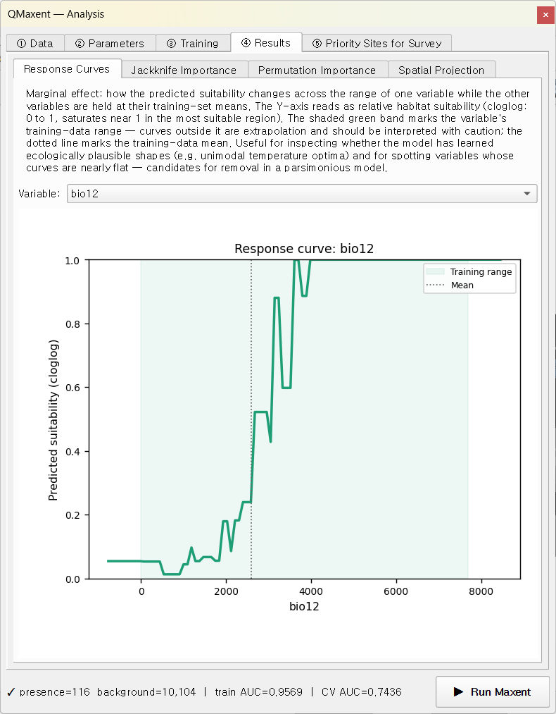
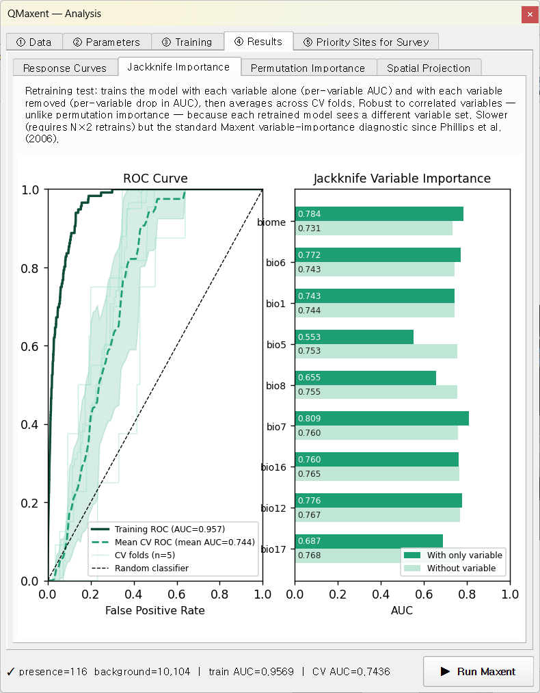
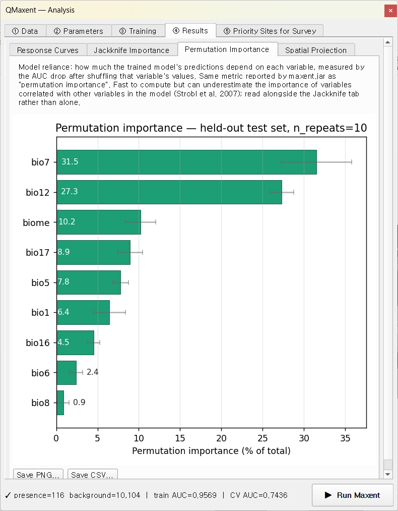
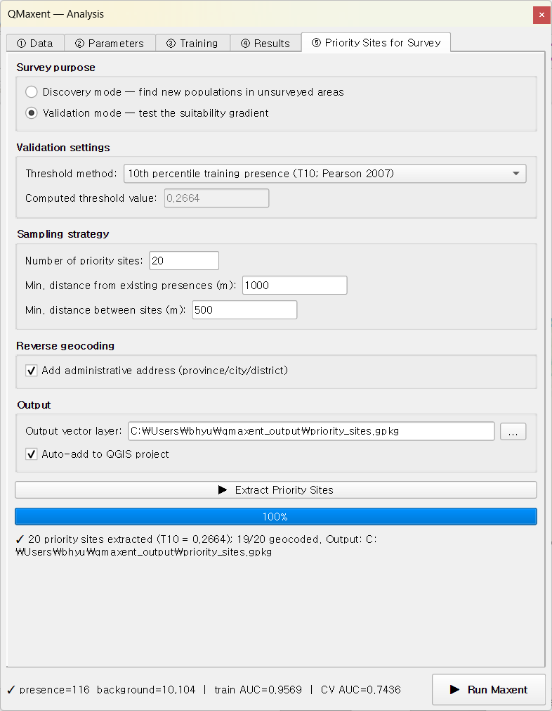
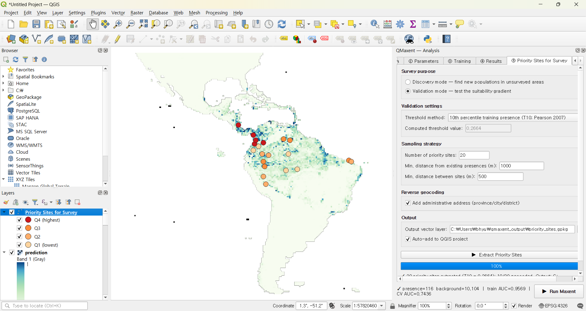

# Bradypus variegatus

The brown-throated three-toed sloth — *Bradypus variegatus* — is the
canonical Maxent test dataset, originally published with
[Phillips, Anderson & Schapire 2006](../references.md) and reused in
virtually every subsequent Maxent paper. We use it here as a
**guided tour of every QMaxent feature**: dependency setup, data
loading, parameter selection, spatial cross-validation, jackknife and
permutation importance, projection, and survey planning. By the end
of this chapter you will have produced — and be able to defend
academically — a complete Bradypus habitat-suitability model.

## 0. Before you start: dependencies

QMaxent installs its third-party Python libraries (elapid, rasterio,
geopandas, scikit-learn, scipy, numpy, matplotlib) into an isolated
virtual environment so they cannot conflict with QGIS's own Python.
The first time you open the plugin, you are invited to perform a
one-time install:

Click **Install / Update Dependencies**. The progress bar walks
through the four pip phases (collecting, downloading, building,
installing) and finishes with the green badge below — at that point
every QMaxent feature is ready to run.

If you ever need to recreate the venv (e.g. after a major QGIS
upgrade), the **Remove Environment** button on the same dialog is the
clean way to start over.

## 1. Dataset

The Phillips et al. (2006) dataset contains:

| Layer | Type | Description |
|---|---|---|
| `bradypus` | Vector point | 116 occurrence records across South and Central America |
| `bio1, bio5, bio6, bio7, bio8` | Continuous raster | Temperature variables (WorldClim) |
| `bio12, bio16, bio17` | Continuous raster | Precipitation variables (WorldClim) |
| `biome` | Categorical raster | Biome type (Olson et al. 2001) |

All rasters share the same grid: EPSG:4326, 0.5° × 0.5° cells, full
Americas coverage. Total dataset size < 100 MB.

Download via **Plugins → QMaxent → Download Example Dataset**, pick
**Bradypus variegatus (Phillips et al, 2006 standard)**, choose a
destination folder, and click **Download**:

Layers are added to the QGIS project automatically:

## 2. Loading data into the Analysis dock

Open **Plugins → QMaxent → QMaxent Analysis**. On **① Data**, pick
`bradypus` from the **Presence Points Layer** drop-down — QMaxent
immediately reports `116 presence points loaded`.

Click **Add from project** to register every loaded raster at once. The
`biome` row gets a `[categorical]` tag (its sidecar metadata says so).
Click **Check Raster Consistency** to verify the grid; the status line
should read
`✓ All 9 rasters share grid (CRS: EPSG:4326, resolution: 0.5 × 0.5)`,
exactly what you expect from the bundled dataset:

**Background Points** is left at its default of 10,000, the value
[Phillips & Dudík 2008](../references.md) recommend for continental
extents. The **Export for external Maxent** panel at the bottom is
optional — leave it alone for this tutorial; see
[Exporting results](../exporting-results.md) for when it matters.

## 3. Model setup

Switch to **② Parameters**. For this tour we accept every default —
each default is the literature-recommended value, and accepting them
lets us inspect what those choices produce:

- **Feature Types**: Auto (the maxnet rule of
  [Phillips & Dudík 2008](../references.md) selects all of LQPHT for
  116 presences).
- **Regularization multiplier**: 1.0
  ([Phillips & Dudík 2008](../references.md) recommendation).
- **Spatial evaluation**: Geographic K-Fold
  ([Anderson 2023](../references.md)), 5 folds, grid 50,000 m,
  buffer 50,000 m, fixed random seed = 42
  ([Roberts et al. 2017](../references.md) default).
- **Jackknife variable importance**: enabled.
- **Permutation importance**: enabled, 10 repeats.
- **Output files**: `qmaxent_output/model.pkl` and
  `qmaxent_output/results.xlsx`.

The fixed random seed means **anyone re-running this tutorial gets
bit-identical results** — central to computational reproducibility
([Araújo et al. 2019](../references.md)).

## 4. Running training and cross-validation

Click **▶ Run Maxent**. The **③ Training** tab takes over and finishes
in about 30 seconds:

The status bar at the bottom summarises the run:
`presence=116 background=10,104 | train AUC=0.9569 | CV AUC=0.7436`.
Reading the log section by section:

- **Full-data model** — `Training AUC = 0.9569`, saved to
  `qmaxent_output/model.pkl`.
- **Cross-validation** — Geographic K-Fold n=5, seed=42:

  | Fold | Test presences | AUC |
  |---:|---:|---:|
  | 1 | 58 | 0.7779 |
  | 2 | 20 | 0.7711 |
  | 3 | 22 | 0.7531 |
  | 4 |  8 | 0.5994 |
  | 5 |  8 | 0.8165 |

  Pooled mean ± std = **0.7436 ± 0.0750**.

- **Jackknife variable importance** — per-variable AUC across the same
  5 folds in three modes (full-model reference, *only this variable*,
  and *without this variable*). The numbers feed the Jackknife plot
  below.
- **Permutation importance** — sklearn `permutation_importance` with
  `n_repeats=10`, evaluated on the held-out test set. Results feed the
  Permutation Importance sub-tab.
- **Save results** — `results.xlsx` and `training_log.txt` are
  persisted next to the `.pkl`.

**Train AUC = 0.957** while **CV AUC = 0.744 ± 0.075**. That gap is
the cost of holding out spatially-distinct validation sets — and a
far more honest measure of real-world predictive performance than the
inflated training AUC alone, exactly the point
[Roberts et al. 2017](../references.md) make.

Folds 4 and 5 have the smallest validation set (8 presences each) and
the largest spread in AUC. In spatial CV, folds are intentionally
uneven in area, and one fold can land on a small, atypical region.
The pooled CV AUC averages over this variance — the **± 0.075
standard deviation** is precisely the quantity you would cite
alongside the mean in a publication.

The full log is exportable via **Save log as…** at the bottom of the
tab; **Copy log** drops it into the clipboard, handy for pasting into
an issue report.

## 5. Inspecting variable behaviour

### Response curves

On **④ Results → Response Curves**, pick `bio12` (annual
precipitation):

The model assigns highest suitability to the 1,500–3,500 mm/year band
— the climatology of South American rainforest — with a sharp drop-off
below ~800 mm. The shape combines hinge and quadratic features. Try
other variables in the drop-down: smooth U- or peak-shaped curves
indicate quadratic terms; sharp angular discontinuities come from
hinge or threshold features.

### Jackknife importance

The **Jackknife Importance** sub-tab compares each variable's stand-
alone signal against its incremental contribution. Dark bars
(*Only this variable*) and light bars (*Without this variable*) tell
you each variable's unique value:

For Bradypus:

- **`bio7`** (annual temperature range) and **`bio12`** (annual
  precipitation) have the strongest stand-alone signals.
- **`biome`** and **`bio6`** (min temp of coldest month) come next.
- The "without" bars are tightly bunched in the high-0.9s — Maxent
  recovers from removing any single variable because the climate
  variables are correlated. This is the textbook
  [Phillips, Anderson & Schapire 2006](../references.md) pattern.

### Permutation importance

The **Permutation Importance** sub-tab reports the same idea from a
different lens: scikit-learn's `permutation_importance` shuffles each
variable's values on the held-out test set, measures the AUC drop,
repeats 10 times, and normalises to 100% of the total:

`bio7` and `bio12` again dominate; the permutation view distributes
the total importance across all variables and is therefore directly
comparable to maxent.jar's per-variable percentage table.

## 6. Spatial projection

Switch to **Spatial Projection** in the same Results tab. Leave
**cloglog** as the output transform (the
[Phillips et al. 2017](../references.md) recommended default) and
**Auto-load result as QGIS layer** ticked, then click
**▶ Run Spatial Projection**:

The map appears in QGIS with auto-styled white-to-green ramping:

The high-suitability core covers Brazil's southeastern Atlantic Forest
and the Amazon basin — both well-known sloth strongholds — plus
secondary patches across Central America. The model correctly
identifies the unsuitability of the Andes (cold, high altitude) and
the very dry Brazilian Northeast (Caatinga).

## 7. Saving outputs

Two files are written automatically:

- `qmaxent_output/model.pkl` — the serialised trained model. Reload it
  later from the Data tab's **Load existing model (.pkl)…** button or
  share it with collaborators. Security note in
  [Saving and reusing models](../saving-models.md).
- `qmaxent_output/results.xlsx` — the multi-sheet supplementary table
  containing experimental setup, variable list, CV results, jackknife,
  permutation, response-curve breakpoints, and threshold tables. See
  [Exporting results](../exporting-results.md) for the sheet-by-sheet
  layout.

If you ticked **Save analysis charts as PNG** before projection, four
additional 300-dpi PNGs of the response curves, ROC, jackknife, and
permutation panels are written next to the GeoTIFF — sized for direct
paste into a single-column manuscript figure.

## 8. Priority sites for survey

A natural next step is to use the trained model to plan follow-up
surveys. **⑤ Priority Sites for Survey** offers two distinct modes —
**Discovery** (looking for *new* populations) and **Validation**
(stratified field-checks across the suitability gradient).

### 8.1 Discovery mode

Discovery picks candidates from a high-suitability band. Open the
tab, keep **Discovery** as the mode, leave the auto-set minimum
suitability of ~0.81, set `n_sites = 20`, leave the 1 km / 500 m
spacing defaults, and click **▶ Extract Priority Sites**:

20 candidate locations (red dots) appear on the suitability map, with
their attribute table populated by Nominatim reverse geocoding:

Each candidate is at least 1 km from any known occurrence and at least
500 m from any other candidate, so a single field trip can plausibly
cover several at once. Discovery is the right mode when the question
is *"where could the species be that we have not yet looked?"* — the
[Rhoden et al. 2017](../references.md) "Maxent-directed surveys"
paradigm.

### 8.2 Validation mode

Switching the **Survey purpose** to **Validation** draws a different
kind of sample: candidates are stratified into four quartiles of
suitability (above a configurable threshold), so a field trip can test
the model's calibration across the full predicted gradient rather than
only its high-suitability core:

The resulting sites span low- through high-suitability cells in
roughly equal numbers, each tagged with its quartile in the attribute
table:

Validation is the right mode for model verification rather than
discovery — it is the field-side complement of the cross-validation
AUC we computed in § 4.

## Next steps

- **The same workflow with messy rasters**:
  [Ariolimax example](ariolimax.md) starts from rasters that do not
  share a CRS or resolution — exercising the Check + Harmonize tools.
- **Compare your workflow to a published study**:
  [Pitta nympha example](pitta-nympha.md) reproduces a published Java
  MaxEnt analysis in QMaxent and discusses where the two pipelines
  agree and differ.
- **Deeper theory**:
  [Methodological background](../methodological-background.md) explains
  why each default we accepted in this tour is the right choice.
