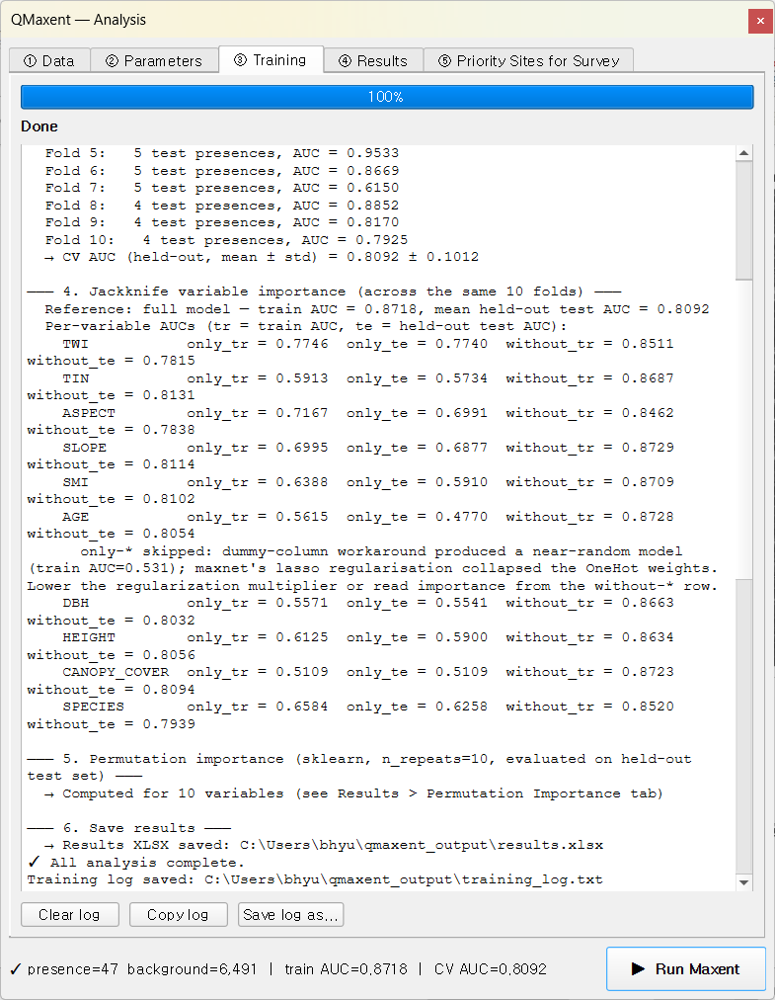
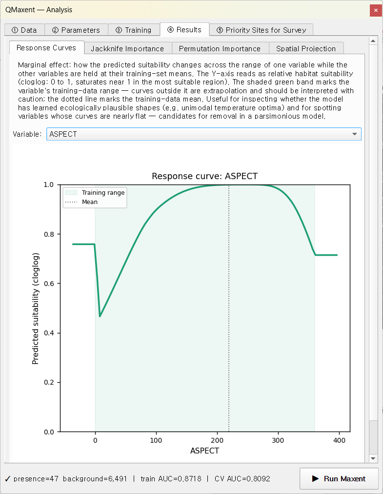
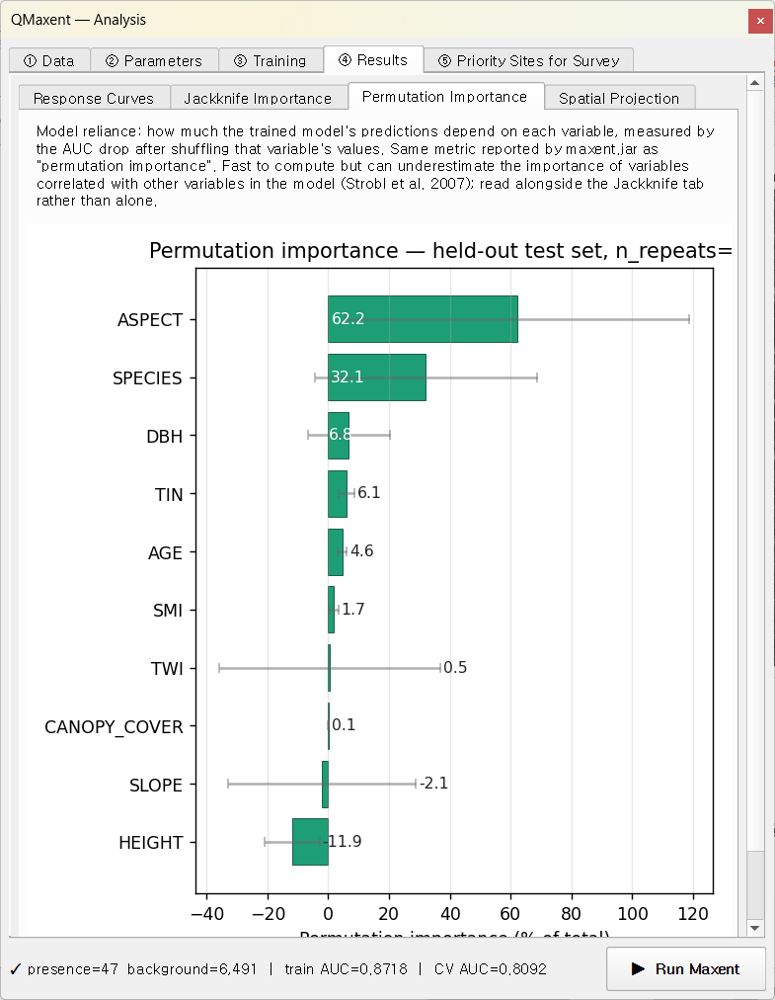

# Pitta nympha

The fairy pitta *Pitta nympha* is a long-distance migratory passerine
that breeds in dense, multi-strata broadleaved forest. The dataset
shipped here reproduces a published field study — Lee et al. (2025,
*Global Ecology and Conservation* 60:e03939) — that surveyed nest
sites on Geoje Island (Geoje-si, South Korea) and trained a Maxent
model with **maxnet R** (ENMeval 2.0). Re-running the same data in
QMaxent serves two purposes:

1. **Worked example for real, small-n field data** (47 nest locations)
   with a mix of continuous topographic variables and a categorical
   forest-age class.
2. **Cross-implementation comparison** with maxent.jar — see § 3.3 of
   the accompanying manuscript for the formal IWLR ↔ coordinate-
   descent equivalence numbers (Default β=1 and Lee-matched β=4).

## 1. Dataset

| Layer | Type | Description |
|---|---|---|
| `pitta_nympha_occurrence` | Vector point | **47** nest locations on Geoje Island |
| `TWI` | Continuous raster | Topographic wetness index |
| `TIN` | Continuous raster | Terrain ruggedness |
| `ASPECT` | Continuous raster | Aspect (degrees, sin-cos pre-processed) |
| `SLOPE` | Continuous raster | Slope (°) |
| `SMI` | Continuous raster | Soil moisture index |
| `AGE` | **Categorical** raster | Forest age class (1–4) |
| `DBH` | Continuous raster | Mean trunk diameter at breast height |
| `HEIGHT` | Continuous raster | Mean canopy height |
| `CANOPY_COVER` | Continuous raster | Canopy closure (%) |
| `SPECIES` | Continuous raster | Dominant tree species (numeric code) |

All ten rasters share a common grid (EPSG:5186 KGD2002 / Central
Belt, 10 m × 10 m). This is real survey-data: the dataset is not
bundled with the plugin's Example Dataset Downloader; the
corresponding author of the manuscript holds the canonical copy
(contact bhyu@knps.or.kr).

## 2. Loading data

On **① Data**, pick `pitta_nympha_occurrence` from the Presence
Points Layer drop-down (47 points), add all ten rasters from the
project, **mark `AGE` as `[categorical]`**, and click
**Check Raster Consistency**:

The status line reads
`✓ All 10 rasters share grid (CRS: EPSG:5186, resolution: 10 × 10)`.
The presence points cluster on Geoje Island's central forested
ridges:

## 3. Lee-matched parameters

On **② Parameters**, switch to **Manual selection** for Feature
Types and tick **Linear**, **Quadratic**, **Hinge** (un-tick
Product and Threshold). Set **Regularization multiplier = 4.00**.
For Spatial evaluation, choose **Random K-Fold (Phillips 2006)**
with **Folds = 10** and seed = 42. Leave Jackknife and Permutation
importance enabled (10 repeats):

This configuration is the one ENMeval selected as optimal in
Lee et al. (2025) and the one labelled "Lee-matched" in § 3.3 of
the accompanying manuscript. Re-running it under maxent.jar
v3.4.4 on the same data yields the maxent.jar side of the
comparison (Training AUC = 0.8692 ± 0.0230, 10-fold CV AUC =
0.8128 ± 0.1022) — within the |Δ| < 0.005 micro-convergence band
documented for IWLR ↔ coordinate-descent in § 2.3.

## 4. Training

Click **▶ Run Maxent**. The Training tab finishes in ~ 20 seconds:

The status bar at the bottom reads
`presence=47 background=6,491 | train AUC=0.8718 | CV AUC=0.8092`.

- **Full-data model** — `Training AUC = 0.8718` (QMaxent side of the
  manuscript's Table 3 Lee-matched row; maxent.jar = 0.8692,
  |Δ| = 0.0026, well within the 0.005 tolerance band).
- **Cross-validation** — Random K-Fold n=10, seed=42. Pooled mean ±
  std = **0.8092 ± 0.1012**. Per-fold AUCs visible in the log range
  from 0.6150 to 0.9533 — a wider spread than Bradypus or Ariolimax,
  reflecting the small sample (4–5 test presences per fold) typical
  of field-survey datasets.

### Jackknife with a categorical variable

The log surfaces a useful diagnostic that does not appear in the
Bradypus / Ariolimax runs:

> `only-*` skipped: dummy-column workaround produced a near-random
> model (train AUC = 0.531); maxnet's lasso regularisation collapsed
> the OneHot weights. Lower the regularization multiplier or read
> importance from the `without-*` row.

`AGE` is the only categorical variable in the stack. In the *only-
this-variable* jackknife pass it must be one-hot encoded, but at
β = 4 the L1 lasso penalty collapses every OneHot weight back to
near-zero — Maxent has nothing left to score with. QMaxent detects
this collapse, skips the affected `only-*` row, and tells you in
plain English. The `without-*` row remains informative and is the
right place to read AGE's incremental contribution.

This is exactly the over-regularisation failure mode
[Merow et al. 2013](../references.md) describe. The β = 1 Default
run (not shown here) recovers a meaningful `only-AGE` AUC.

## 5. Variable behaviour

### Response curve — `ASPECT`

The model assigns highest suitability to north-facing aspects
(roughly 270°–360°), consistent with the fairy pitta's known
preference for shaded, cool, humid microclimates on ridge shoulders.

### Jackknife importance

`ASPECT`, `TWI`, and `SPECIES` carry the strongest *without-row*
signals — removing them costs the most. `AGE`'s `only-*` bar is
absent for the reason described in § 4 above; its `without-*`
ranking (~ 0.81) places it mid-pack, which is the honest reading.

### Permutation importance

The permutation pass evaluates each variable on the held-out test
set independent of the lasso shrinkage that disabled AGE's
`only-*` row, so all ten variables get a comparable percentage:

The agreement between Jackknife `without-*` and Permutation
rankings (Spearman ρ at this β = 4 configuration is small, see
manuscript § 3.3) reflects the over-regularisation effect rather
than an implementation bug.

## 6. Priority sites for survey

After projection, the **⑤ Priority Sites for Survey → Discovery**
mode produces field-trip candidates on Geoje. Because the study
area is much smaller than Bradypus or Ariolimax, the suitability
threshold (~ 0.88) and spacing rules (1 km from existing
presences, 500 m between candidates) yield a tractable list of
about twenty new search locations:

Nominatim reverse geocoding populates the attribute table with
administrative names down to *eup/myeon/dong* level where
available — a one-step path from model to field-trip planning.

## 7. What this example demonstrates

1. **Real-data workflow with small-n field surveys** (47 presences,
   10 covariates, real-world spatial scale).
2. **Categorical variable handling** plus the OneHot-collapse
   diagnostic when over-regularised.
3. **The Lee-matched (β = 4) configuration** that the accompanying
   manuscript uses for its maxent.jar numerical-compatibility
   benchmark (§ 3.3 / Table 3).
4. **A different, narrower kind of priority-sites use-case** —
   targeted re-survey of known sub-populations rather than continental
   discovery.

For the formal maxent.jar ↔ QMaxent comparison numbers (Training
AUC |Δ| < 0.005, permutation-importance Spearman ρ at both β=1 and
β=4) see the accompanying manuscript's § 3.3 and the JSON record
under `tests/fixtures/pitta_golden_values.json`.
