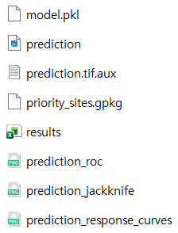
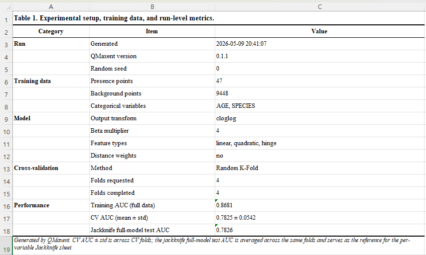
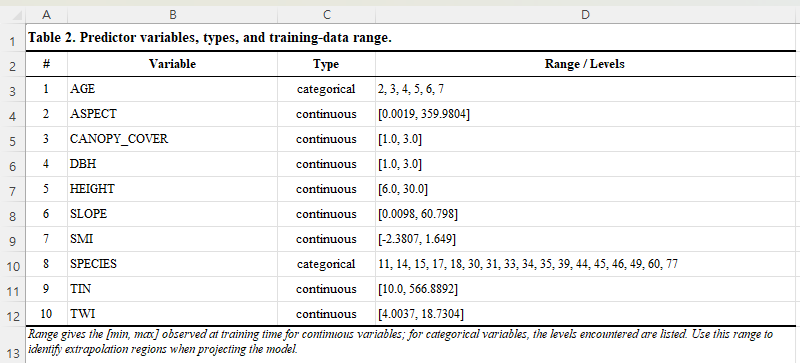
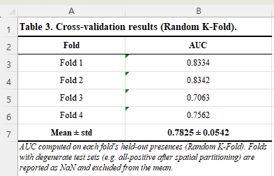
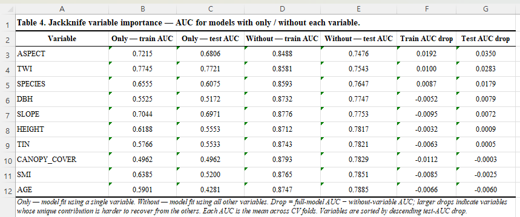
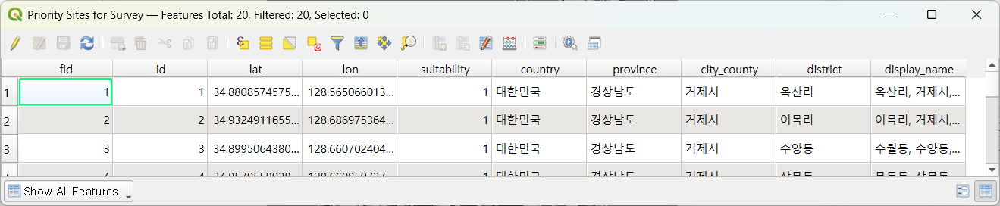

# Exporting results

Every QMaxent training run writes a **multi-sheet XLSX workbook** alongside
the `.pkl` model. The workbook is intentionally formatted to read as a
**Supplementary Table block** for an academic manuscript: Times New Roman,
table-numbered headings, row footers explaining how each metric was
computed. You can paste sheets directly into a paper's appendix.

## Output folder layout

After a training run that also produced a spatial projection and the
`Save analysis charts as PNG` checkbox was on, the output folder looks
like this:

| File | Produced by | Use |
|---|---|---|
| `model.pkl` | Training | Reload later via *Load existing model (.pkl)…* |
| `prediction.tif` | Spatial projection | Habitat-suitability raster |
| `prediction.tif.aux` | Spatial projection | QGIS auxiliary metadata |
| `results.xlsx` | Training | Multi-sheet supplementary table |
| `priority_sites.gpkg` | Priority Sites tab | Field-ready candidate points |
| `prediction_roc.png` | Spatial projection | ROC curve (300 dpi) |
| `prediction_jackknife.png` | Spatial projection | Jackknife bars (300 dpi) |
| `prediction_response_curves.png` | Spatial projection | All response curves (300 dpi) |

## Sheet-by-sheet description

The XLSX has four to five sheets depending on which features you ran.
The screenshots below are from a Pitta nympha run — the *format* is
identical for every dataset; only the values change.

### Table 1 — Experimental setup

A one-page record of the full run configuration. Reviewers can verify
seed, variable count, regularization, CV scheme, and training/CV AUCs
at a glance.

This sheet is the single best artefact for **methods-section
reproducibility**. Cite it as your "Table S1" and a reader can
re-execute the analysis bit-identically.

### Table 2 — Predictor variables

Lists every environmental variable, its type (`continuous` /
`categorical`), and its training-data range. For continuous variables
the range is `[min, max]`; for categorical, the discrete set of levels
encountered during training.

Use this sheet to document **extrapolation scope**: any prediction
applied to environmental values outside these ranges is by definition
extrapolation and should be flagged in your results discussion.

### Table 3 — Cross-validation results

Per-fold held-out AUC and the across-fold mean ± standard deviation —
the headline performance estimate.

Folds with degenerate test sets (e.g. all-positive after spatial
partitioning) are reported as `NaN` and excluded from the mean. This
matches the way the original Maxent literature handles the rare cases
where a fold cannot produce a valid AUC.

### Table 4 — Jackknife variable importance

For each variable, four AUCs (only-train, only-test, without-train,
without-test), plus a "Train AUC drop" and "Test AUC drop" column to
make the contribution magnitudes scannable. Variables are sorted by
*descending Test AUC drop* so the most uniquely-informative variables
are at the top.

The footer note explains the drop columns:
*Drop = full-model AUC − without-variable AUC; larger drops indicate
variables whose unique contribution is harder to recover from the others.*

### Optional Table 5 — Priority sites

If you ran the **Priority Sites for Survey** tab, the same workbook
gains a fifth sheet with one row per candidate location. The columns
include `lat`, `lon`, `suitability`, and — when reverse geocoding was
enabled — `country`, `province`, `city_county`, `district`, and the
human-readable `display_name`. The format is the same one QMaxent uses
inside the GeoPackage:

## Customizing the export

The default file path on the **② Parameters** tab is
`<home>/qmaxent_output/results.xlsx`. Change it to anywhere writable;
relative paths are resolved against the current QGIS project folder.

To **stop the XLSX from being written** (rare — usually faster to ignore
the file than to disable it), simply clear the path field. QMaxent will
skip the export and emit a notice in the training log.

The PNG analysis charts are controlled by the **Save analysis charts
as PNG** checkbox on the **④ Results → Spatial Projection** sub-tab.
With it ticked, three additional PNGs are written next to the GeoTIFF
at the moment you run projection. They are sized for **direct paste
into a single-column manuscript figure** (300 dpi, ~1.6 MB each).

## Citing the workbook

The XLSX was designed to be cited the way published supplementary
tables are cited:

> Yu, B.-H. (2026). QMaxent results workbook for *<species>*
> [Supplementary table]. https://github.com/osgeokr/qmaxent

If your model is reproducible (fixed seed + same input rasters) you
can also distribute the `model.pkl` alongside the XLSX so reviewers
can re-load the model and inspect predictions independently.
