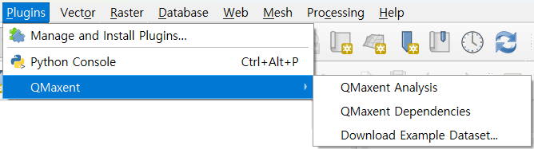

# Installation

QMaxent installs as a regular QGIS plugin. After the plugin itself is in place,
a one-time dependency setup downloads the Python libraries Maxent needs into
an isolated virtual environment that does not affect your system Python or
QGIS itself.

## System requirements

- **QGIS** 3.44 LTR or later
- **Operating system**: Windows 10/11, macOS 12+, or any modern Linux distribution
- **Disk space**: ~500 MB free for the Python virtual environment
- **Internet access** is required only on first run to download the Python
    dependencies; routine model fitting and projection run fully offline.

## Install from the QGIS Plugin Repository

QMaxent is published on the [official QGIS Plugin Repository](https://plugins.qgis.org/plugins/qmaxent/).

1. Open QGIS and choose **Plugins → Manage and Install Plugins…**
2. In the **All** tab, type `qmaxent` in the search box. The plugin appears
    in the result list.
3. Click **Install Plugin**.

Once installed, three entry points appear under **Plugins → QMaxent**:

| Menu item | What it does |
|---|---|
| **QMaxent Analysis** | Opens the main analysis dock — the heart of the plugin |
| **QMaxent Dependencies** | Opens the dependency-management dialog (next chapter) |
| **Download Example Dataset** | Bundled SDM datasets for tutorials (covered in *Example datasets*) |

## Verifying the installation

Choose **Plugins → QMaxent → QMaxent Dependencies**. If the dialog opens, the
plugin is correctly installed. The **Environment Status** banner will most
likely read *Dependencies not installed* the first time — that is expected and
is dealt with in the next chapter.

## Updating to a newer version

When a new release ships, the QGIS Plugin Manager will mark QMaxent as
upgradable. Click **Upgrade Plugin** in the **Installed** tab. Dependencies
generally do not need to be reinstalled across patch releases (0.1.x → 0.1.y);
QMaxent will alert you in the **Dependencies** dialog if anything has changed.

## Troubleshooting

??? warning "QMaxent does not appear in the search results"
    Make sure your QGIS version is 3.44 or later (`Help → About QGIS`).
    On older versions QMaxent is filtered out as incompatible. Also confirm
    the **Show experimental plugins** option in **Settings** is set to your
    preference — QMaxent's stable releases do not require it.

??? warning "Plugin installs but the menu entry does not appear"
    Restart QGIS. Some QGIS versions require a restart for top-level menu
    entries from new plugins to register.

??? warning "Corporate proxy or restricted network"
    The plugin install itself uses QGIS's network stack and respects QGIS's
    proxy settings. The dependency installer (next chapter) downloads from
    [PyPI](https://pypi.org); if your organisation blocks PyPI, ask your
    network administrator to allow `pypi.org` and `files.pythonhosted.org`.
