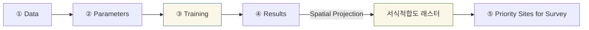

# Analysis 도크

QMaxent Analysis 도크는 플러그인의 핵심으로, 전체 SDM 워크플로를 **다섯 개의 번호
매겨진 탭** 으로 정리해 좌에서 우로 순서대로 따라갈 수 있게 합니다. 본 장은 전체
레이아웃을 빠르게 둘러보며, 각 탭에 대한 상세 설명은 별도 장에서 다룹니다.

## 도크 열기

**플러그인 → QMaxent → QMaxent Analysis** 를 선택합니다. 도크는 기본적으로 QGIS 메인
윈도우 우측에 열리며, 표준 QGIS 패널 핸들로 분리·플로팅·재도킹할 수 있습니다.

## 다섯 탭 한눈에 보기

| # | 탭 | 하는 일 |
|---|---|---|
| ① | **Data** | 종(출현 지점 레이어)과 환경 변수 래스터 선택 / 정합 확인 |
| ② | **Parameters** | Maxent 피처 유형, 정규화, 공간 교차검증, 출력 경로 설정 |
| ③ | **Training** | 모델 학습 진행 상황과 AUC·Jackknife·경고 로그 확인 |
| ④ | **Results** | 반응곡선, Jackknife 변수 중요도 확인 / 공간 투영 실행 |
| ⑤ | **Priority Sites for Survey** | 학습된 모델로 현장 조사용 후보지 생성 |

번호 접두어는 의도적입니다 — 순서를 명시합니다. **Training** 이 끝나기 전에는
**Results** 탭을 사용할 수 없고, **Priority Sites** 는 완성된 투영 래스터가 필요합니다.

## 상태바와 Run 버튼

어느 탭을 보고 있든 두 요소는 고정으로 유지됩니다:

- 좌측 하단의 **상태바** 는 현재 모델 상태를 요약합니다(예:
    `presence=116 background=10,113 train AUC=0.9562 CV AUC=0.7581`).
    학습 전에는 비어 있고, 학습 후 채워집니다.
- 우측 하단의 큰 **▶ Run Maxent** 버튼은 전체 학습+평가 파이프라인을 시작합니다.
    클릭하면 자동으로 Training 탭으로 전환됩니다.

## 기존 모델 불러오기

처음부터 시작하지 않고 이전에 학습한 모델을 재사용하고 싶을 때가 있습니다.
**Data** 탭 우측 상단의 **Load existing model (.pkl)…** 버튼은 저장된 Maxent 모델을
복원하고, 각 모델 변수를 현재 QGIS 래스터 레이어에 매핑하는 절차를 안내합니다.
전체 워크플로와 pickle 파일 보안 안내는 [모델 저장 및 재사용](saving-models.md)
참고.

## 일반적인 워크플로

다음 다섯 장에서 각 탭을 차례로 다룹니다.
