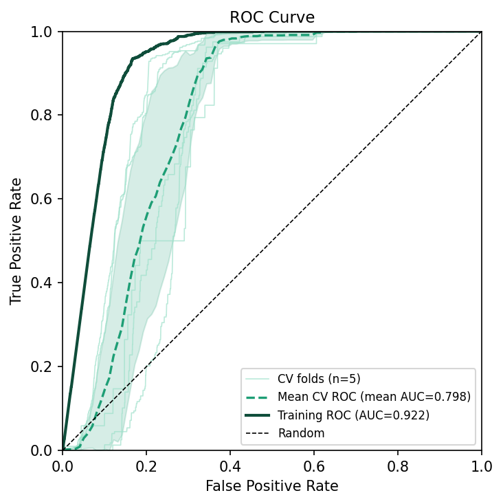
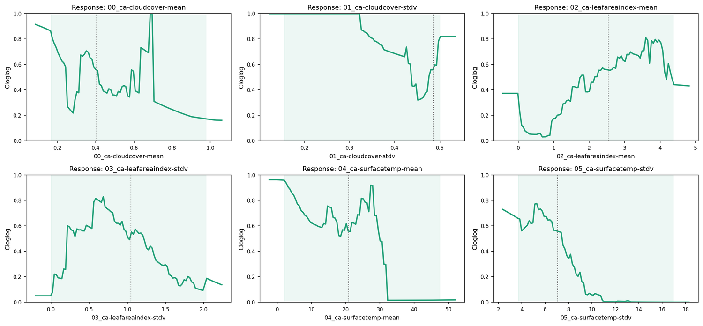

# Ariolimax

태평양바나나민달팽이 *Ariolimax columbianus* 가 두 번째 실전 예제입니다.
Bradypus의 기능 입문과 다르게, 이 데이터셋은 의도적으로 *지저분합니다* —
환경 변수 래스터들이 공통 좌표계, 범위, 해상도를 공유하지 **않습니다**.
본 장은 QMaxent의 **Check Raster Consistency** 사전 점검과
**Harmonize to Folder…** 워크플로를 따라가면서, 그렇지 않으면 조용히
잘못된 결과를 만들 실패 모드와 그것을 단번에 해결하는 도구를 보여줍니다.

## 데이터셋

Ariolimax 데이터셋은 [elapid](https://github.com/earth-chris/elapid)의
기본 테스트 데이터입니다. **플러그인 → QMaxent → Download Example
Dataset → Ariolimax** 를 실행하면 캘리포니아 해안 산맥에 걸친 레이어들이
QGIS 캔버스에 나타납니다. 출현 지점은 파란색으로 표시:

겉으로는 데이터가 이미 정렬된 것처럼 보입니다. 하지만 래스터 타일들은
서로 다른 원격탐사 파이프라인에서 만들어져 서로 다른 투영법과 해상도를
가집니다 — 정확히 Maxent를 조용히 망가뜨리는 상황입니다.

## 불일치 문제

**플러그인 → QMaxent → QMaxent Analysis** 를 엽니다. **① Data** 에서
`ariolimax-ca` 출현 레이어 (3,732점) 를 선택, **Add from project** 로
모든 로드된 래스터 등록, **Check Raster Consistency** 클릭:

상태 줄이 황색으로 변하며 다음을 보고합니다:

> ⚠ Grid mismatch — CRS, extent, resolution differ across rasters.
> Click "Harmonize to Folder…" to align.

핵심: **Run Maxent 버튼은 차단되지 않습니다** — Maxent 자체는 그래도 숫자를
만들어냅니다. 다만 그 숫자는 조용히 잘못됩니다 — 공변량이 출현 지점 *명목상*
아래의 셀에서 추출되지만 실제로는 정렬되지 않은 래스터에서 추출되기 때문.
이는 운영 SDM에서 가장 흔한 silent-failure 모드이며, 이 사전 점검이 존재하는
바로 그 이유입니다.

## Harmonize to Folder… 실행

불일치가 감지되면 **Check Raster Consistency** 버튼 옆에 새 버튼이
나타납니다 — **Harmonize to Folder…**. 클릭 후 출력 폴더를 선택하세요.
QMaxent가 **가장 높은 해상도 래스터를 기준 격자로 선택**하고, 모든 다른
래스터를 그 격자로 [`gdalwarp`](https://gdal.org/programs/gdalwarp.html)
(범주형은 nearest-neighbour, 연속형은 bilinear) 로 재투영해 새 GeoTIFF를
폴더에 작성합니다. 새 파일들이 자동으로 프로젝트에 추가되고 옛 파일은
QMaxent 래스터 목록에서 제거됩니다.

Data 탭이 조화화된 스택으로 새로고침됩니다:

상태 줄이 이제 초록색:

> ✓ All 6 rasters share grid (CRS: EPSG:32610, resolution: 1000 × 1000).

파일명 관례에 주목 — 조화화된 래스터는 `00_`, `01_`, … 접두어가 붙어
순서가 고정됩니다. 이는 `.qgz` 저장·재로드를 통해서도 유지되며, 모델 변수
순서는 모델의 정체성의 일부이므로 이 접두어가 그 순서를 파일시스템 수준에서도
보이게 만듭니다.

## 모델 실행

스택이 조화화되면, 나머지 워크플로는 [Bradypus](bradypus.md) 와 동일합니다.
**② Parameters** 의 기본값을 그대로 사용하고 **▶ Run Maxent** 클릭, 학습이
완료될 때까지 기다립니다. 5-fold ROC 곡선은 학습과 CV 성능 사이의 건강한
분리를 보여줍니다:

Jackknife 패널은 종의 신호를 어떤 환경 변수가 담고 있는지 확인해줍니다:

`05_ca-surfacetemp-stdv` (지표 온도 변동성) 가 가장 강한 단변량 신호를
가집니다 — 활동 시간대가 시원하고 습한 미기후에 의존하는 생물에게
생태적으로 합리적입니다. 평균 온도 변수는 단독 영향력은 낮지만 제거할 때
영향이 큽니다 (without 막대가 떨어짐) — 다른 변수와 중복되지 않는 정보를
가진 변수의 특징입니다.

전체 한계 반응 곡선은 학습 범위에 걸친 각 변수의 부분 의존성을 보여줍니다:

## 조화화 전후 모델 비교

교육적 연습으로 *조화화하지 않은* 스택에서 한 번 돌려보시길 권합니다.
Maxent의 관대한 래스터 처리 덕에 완성된 모델과 완성된 AUC를 얻겠지만,
AUC는 보통 조화화 실행보다 0.05–0.10 더 *높게* 나옵니다 — *모델이 더
좋아서가 아니라*, 공변량 어긋남이 모델이 적합하는 가짜 패턴을 만들어내기
때문. 교차검증 격차 (학습 vs. CV AUC) 가 이에 비례해 벌어집니다. 결론을
내리기 전에 항상 **Check Raster Consistency** 를 실행하세요.

## 우선조사 후보지

투영 후, **⑤ Priority Sites for Survey** 로 전환, **Discovery** 모드 선택,
후보지 추출. 사이트가 적합도 지도가 강조한 동일한 해안 산맥에 떨어지며,
조사팀은 결과 GeoPackage를 그대로 현장으로 가져갈 수 있습니다:

## 본 예제가 보여주는 것

1. **래스터 불일치 시 Maxent의 silent-failure 모드**
2. **QMaxent의 사전 점검 + 조화화 도구** — 프로젝트를 망칠 실수를 한 번의
    클릭으로 해결

이 습관을 본인 작업에도 가져가세요 — 새 래스터 스택을 조립할 때마다 학습
*전에* Check Raster Consistency를 실행. 실패하면 먼저 조화화, 그다음 학습.
