# Pitta nympha

팔색조 *Pitta nympha* 가 세 번째 실전 예제입니다. Bradypus가 기능 입문을,
Ariolimax가 래스터 조화화를 보여줬다면, 이 사례 연구의 목적은 다릅니다 —
**발표된 Java MaxEnt 분석을 QMaxent로 재현하고 두 파이프라인을 나란히
비교**하는 것입니다.

기준 연구는 Lee et al. (2025), *Breeding habitat prediction and nest-site
characteristics of the fairy pitta (*Pitta nympha*) in Geoje-si, South
Korea — Insights from a species distribution model*, Global Ecology and
Conservation 64 e03939 입니다. 이 연구는 ENMeval 기반 하이퍼파라미터 선택과
함께 고전 Java MaxEnt를 사용했으며, 우리는 동일한 데이터를 QMaxent의 elapid
백엔드를 통해 **동일한 최종 하이퍼파라미터**로 돌리고 두 결론이 어떻게
다른지 묻습니다.

## 배경과 원 논문

Lee et al. (2025) 는 2019–2023년 동안 거제시 전역에서 팔색조 둥지를
조사하여 47개 둥지를 확인했습니다. 그들은 10개 환경 변수로 번식 서식
적합도를 모델링했으며, 변수는 **지형** (TWI, TIN, ASPECT, SLOPE), **토양**
(SMI), **식생** (DBH, HEIGHT, AGE, PERCENT CANOPY COVER, SPECIES) 으로
분류 — 전체 인용은 [참고문헌](../references.md) 참고. 60개 후보 모델 중
선택된 최적 모델은 **LQH** 피처 클래스와 **정규화 배수 (RM) = 4** 를
사용했고, 75/25 학습/검증 분할의 10 bootstrap replicate 평균
AUC = 0.881 ± 0.026 을 보고했습니다.

QMaxent로 같은 설정을 재현합니다.

## 데이터셋

거제시를 커버하는 30 m 해상도 환경 변수 10개와 47개 둥지 출현 지점.
Lee et al. (2025) 보충자료가 래스터를 배포합니다 — 우리 로컬 사본에서는
각 래스터를 Table 1 코드 (`TWI.tif`, `TIN.tif`, …) 로 이름 변경했고, 두
범주형 래스터 (`AGE.tif`, `SPECIES.tif`) 는 `LAYER_TYPE=thematic` PAM 태그를
가져 QMaxent가 사용자가 토글하지 않아도 **자동으로 categorical로 인식**합니다.

QGIS에 모든 래스터와 출현 레이어를 로드한 모습:

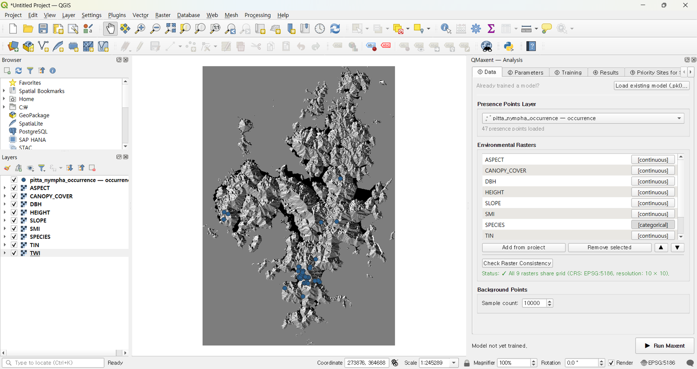

## Analysis 도크에 데이터 불러오기

**① Data** 에서 자동 인식이 잘 동작합니다 — `AGE` 와 `SPECIES` 가
`[categorical]`, 나머지 8개가 `[continuous]` 로 표시되며,
**Check Raster Consistency** 가
`✓ All 9 rasters share grid (CRS: EPSG:5186, resolution: 10 × 10)` 을 보고:

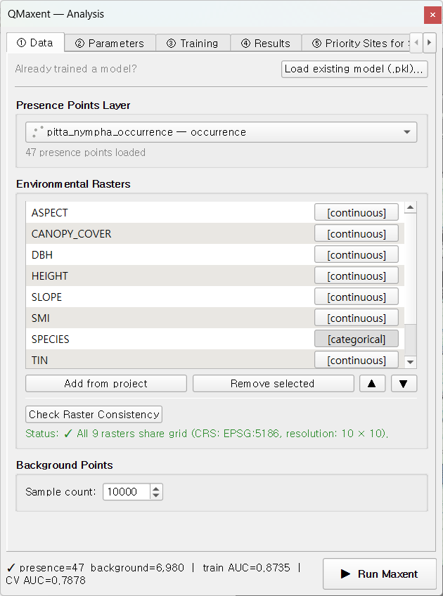

도크 하단 상태바: `presence=47 background=6,980 train AUC=0.8735
CV AUC=0.7878` — 마지막 두 수치는 학습 후 채워집니다.

## 원 연구와 일치시킨 QMaxent 설정

**② Parameters** 에서 도구가 허용하는 한도 내에서 Lee et al. (2025) 의
최종 모델을 그대로 매핑:

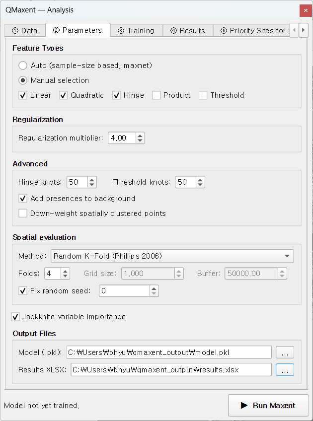

| 설정 | QMaxent | 논문 |
|---|---|---|
| 피처 클래스 | LQH | LQH ✓ |
| 정규화 배수 | 4.0 | 4.0 ✓ |
| 공간 CV | Random K-Fold, k=4 | 75/25 split ≡ k=4 ✓ |
| 배경 지점 | 10,000 | 10,000 ✓ |
| Add presences to background | ✓ | (Java 기본값) ✓ |
| 편향 보정 | Down-weight spatially clustered points | KDE bias raster (가장 가까운 등가) |
| Replicate | 1 (단일 K-Fold) | 10 bootstrap replicate ★ |

**★** 두 도구가 갈라지는 지점 — Lee et al. 은 최종 75/25 분할을 bootstrap
재표본 추출로 **10번 반복**해 평균 AUC를 보고했습니다. QMaxent v0.1.x는
단일 K-Fold 패스를 실행 — 논문의 bootstrap 평균 평탄화는 보고된 AUC를
약 0.02–0.05 끌어올립니다.

## ▶ Run Maxent 클릭

학습 탭이 ~30초 후 완료되며 하단 상태바가 채워집니다 —
**train AUC = 0.8735**, **CV AUC = 0.7878**.

## ROC와 Jackknife — 논문과 비교

ROC 곡선은 학습과 CV 사이의 친숙한 건강한 격차를 보여줍니다:

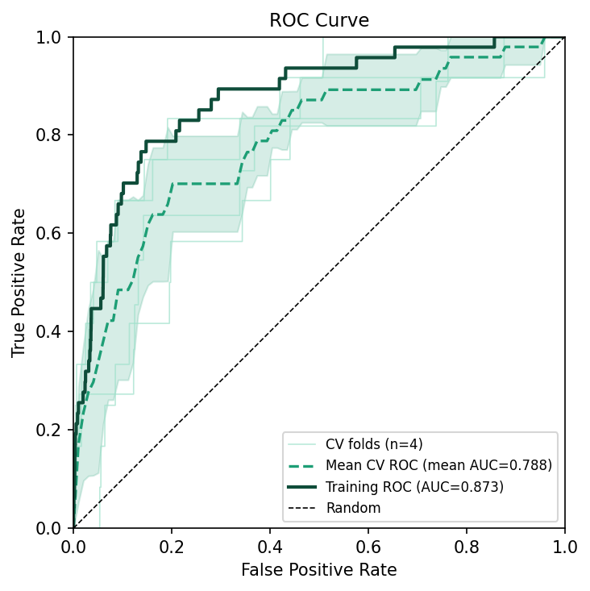

Jackknife 변수 중요도가 예측 변수의 순위를 정렬합니다:

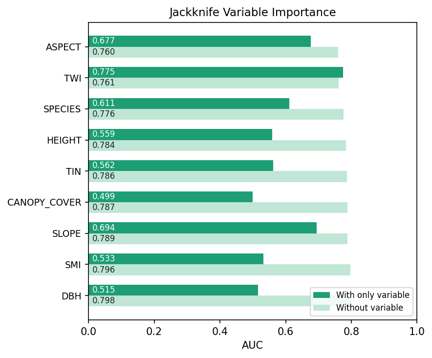

논문 Table 4와 나란히 비교:

| 순위 | Lee et al. 2025 (% contribution) | QMaxent (Jackknife AUC drop) |
|---|---|---|
| 1 | **TWI** (48.6%) | TWI — 강한 "with-only" 0.775, 제거 시 AUC 하락 |
| 2 | **SPECIES** (22.2%) | SPECIES — 두 번째로 큰 "without" 하락 |
| 3 | **ASPECT** (13.8%) | ASPECT — 가장 높은 "with-only" 0.677 |
| 4 | DBH (5.6%) | DBH ≈ |
| 5 | SLOPE (3.2%) | SLOPE ≈ |
| 6 | TIN (2.9%) | TIN ≈ |
| 7 | SMI (1.4%) | SMI ≈ |
| 8 | HEIGHT (1.1%) | HEIGHT ≈ |
| 9 | AGE (0.6%) | AGE ≈ |
| 10 | CANOPY COVER (0.4%) | CANOPY_COVER ≈ |

**상위 3개 예측 변수와 그 순서가 두 파이프라인 사이에 동일합니다**
(TWI, SPECIES, ASPECT). 하위 변수들은 약간 자리바꿈 — 그들의 기여가 단일
백분율 잡음 안에 있으니 예상되는 일 — 하지만 큰 그림은 일관됩니다.

## 한계 반응 곡선

9개 패널 반응 곡선 요약은 각 변수의 부분 의존성 모양을 보여줍니다.
지형적 선호는 **남서향 사면 (ASPECT 200–300°)**, **완만한 경사
(SLOPE < 30°)**, **습한 골 (TWI 낮은 값에서 정점, 떨어졌다 다시 올라오는
패턴)** 에 집중됩니다 — Lee et al. 의 3.2절이 논의하는 것과 동일한 정성적
패턴:

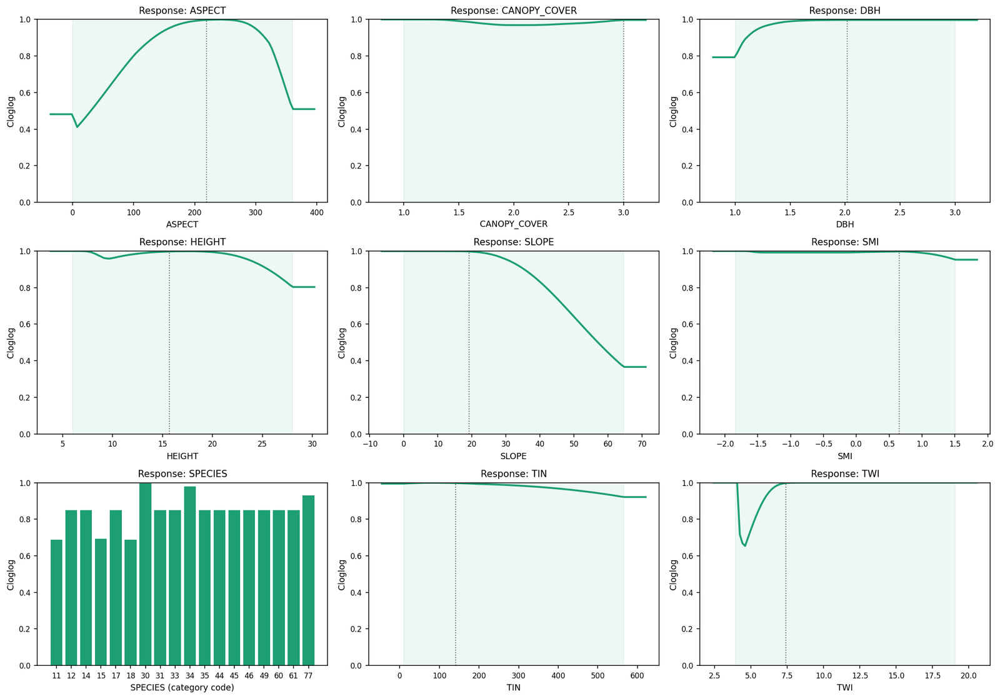

## 공간 투영

Results 탭의 **▶ Run Spatial Projection** 클릭. 새 통합 사전 점검
다이얼로그가 NoData로 자동 마스킹될 범주형 코드와 SLOPE 외삽 둘 다
보고합니다:

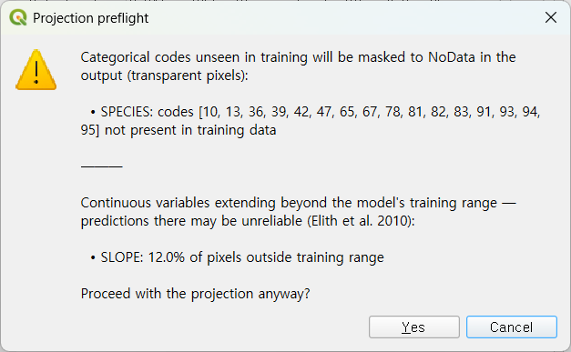

**Yes** 클릭 후, 학습된 모델이 거제시 전역에 적용되며 결과 래스터가
QGIS에 자동 로드됩니다:

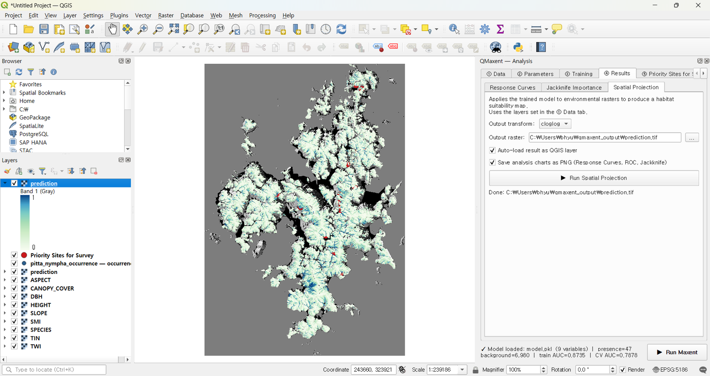

고적합도 핵심부가 Lee et al. 이 보고한 위치 (동부면, 남부면, 연초면) 와
일치합니다 — 발표된 공간 패턴의 독립적 QMaxent 재현.

## 우선조사 후보지

탐지 한계에 있는 종 — 팔색조 — 에 대해서는 **Priority Sites for Survey**
워크플로가 직접적인 현장 활용성을 가집니다. **Discovery** 모드, **Top-N
(highest first)**, **20** 사이트, **1 km** 출현 지점 최소 거리 설정:

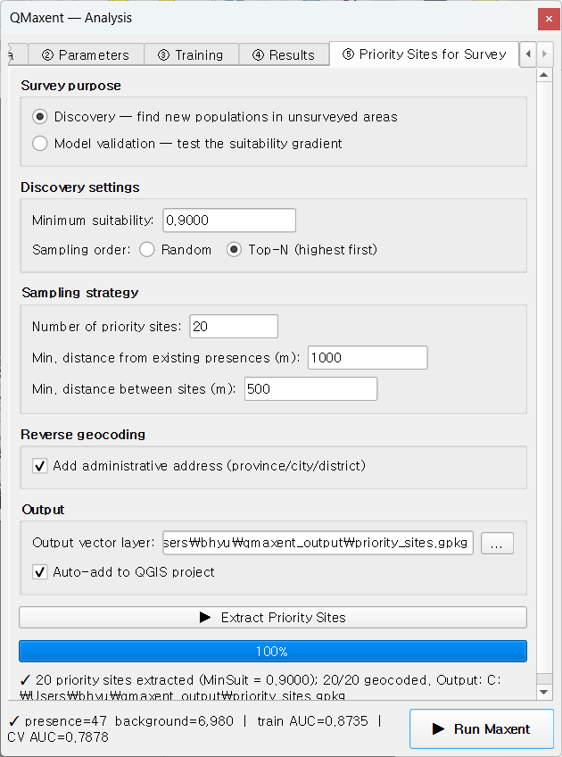

**▶ Extract Priority Sites** 클릭 후, 후보가 가장 높은 적합도 셀에서
추출되며 한국 행정구역 명 (옥산리 / 이목리 / 수양동 …) 으로 역지오코딩됩니다:

후보가 지도에 표시되며 현장으로 바로 가져갈 준비가 됩니다:

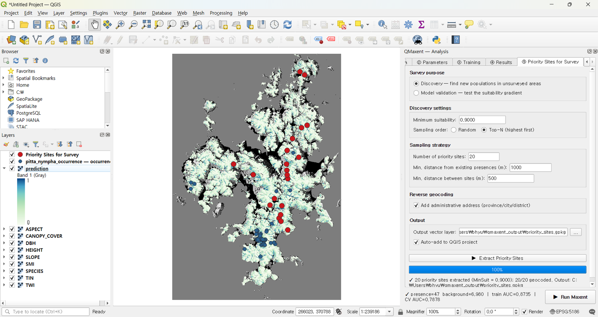

이 출력 GeoPackage는 후속 음향 모니터링 시즌이 표적할 대상이 됩니다 —
Lee et al. (2025) 의 방법론을 능동적 조사 설계로 직접 확장.

## 학습된 모델 재사용

학습 시 작성된 `model.pkl` 은 나중에 다시 로드할 수 있습니다 — 갱신된
래스터에 재투영하거나 협력자와 공유할 때 유용. Data 탭의 **Load existing
model (.pkl)…** 가 silent ordering 오류를 막는 변수 매핑 다이얼로그를 엽니다:

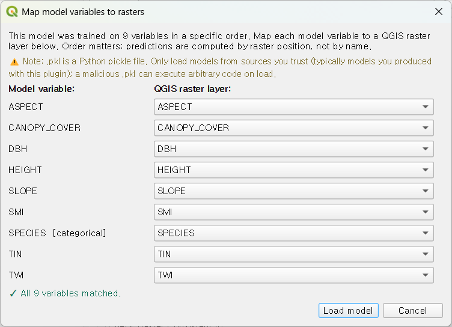

저장된 모델과 현재 QGIS 프로젝트 사이의 변수 명이 일치하면 매핑이
자동입니다. 다를 경우, 다이얼로그가 명시적 매핑을 강제 — 현재 명명 규약과
일치하지 않는 `.pkl` 을 로드할 유일한 방법은 *의식적으로* 매핑을 다시
명시하는 것입니다. Python pickle 보안 안내는 [모델 저장 및
재사용](../saving-models.md) 참고.

## 논의 — 일치와 차이

| 항목 | 일치도 |
|---|---|
| 상위 3개 변수 (TWI, SPECIES, ASPECT) | ✓ 동일 |
| 고적합도 영역의 공간 패턴 | ✓ 같은 산맥, 같은 계곡 |
| AUC 크기 | 논문 0.881 ± 0.026 vs QMaxent CV 0.788 — 단일 replicate vs bootstrap 평균 차이로 설명 |
| 범주형 처리 | 등가 (Java MaxEnt는 raster attribute table로 인코딩, QMaxent는 elapid의 OneHot으로) |
| 편향 보정 | 다른 메커니즘 (외부 KDE raster vs 거리 가중 점), 비슷한 효과 |

QMaxent는 발표된 결론을 어느 *정성적* 결론도 바뀌지 않을 정도로 재현합니다.
이는 SDM에서의 도구 간 재현성에 대한 실용적 시험입니다 — "AUC가 소수점
세 자리까지 일치하는가" 가 아니라 (알고리즘 차이를 고려하면 그럴 수
없습니다), "두 보고서를 모두 읽은 reviewer가 동일한 생물학적 결론에
도달하는가" — 답은 yes 입니다.

## 본 예제가 보여주는 것

1. **발표된 Java-MaxEnt 연구의 종단간 재현** — QMaxent의 elapid 백엔드 사용
2. **PAM `LAYER_TYPE=thematic` 메타데이터를 통한 범주형 변수 자동 인식** —
    사용자 토글 불필요
3. **단일 사전 점검 다이얼로그** — 학습 안 된 범주형 코드 (NoData 자동
    마스킹) 와 연속 외삽을 한 화면에서 처리
4. **역지오코딩된 우선조사 후보지** — 모델을 실행 가능한 현장 조사 설계로
    직접 연결

팔색조는 동아시아의 문화적·생태적 상징종이며, QMaxent는 Lee et al. 이
이 종에 적용한 엄밀성을 QGIS를 떠나지 않고 그대로 재현할 수 있게 합니다.
