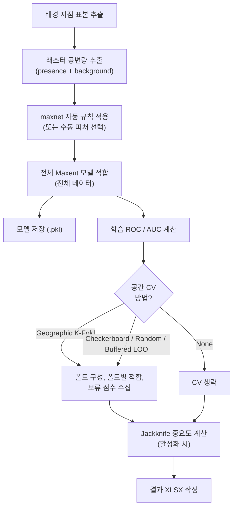

# ③ 학습 탭

도크 하단의 **▶ Run Maxent** 를 클릭하면 학습 탭으로 포커스가 이동합니다. 진행률
바가 폴드별 진행을, 그 아래 로그 패널이 모델이 수행 중인 작업을 실시간으로 기록합니다 —
느린 실행, 거대한 래스터, 수렴 문제를 진단할 때 유용합니다.

## Run 클릭 시 일어나는 일

QMaxent가 다음 파이프라인을 실행합니다 — 각 단계가 로그에 상태 줄을 작성합니다:

전체 파이프라인이 일반적인 데이터셋(약 100개 출현 지점, 10개 래스터, 10,000개
배경 지점)에서 모던 노트북 기준 **15–60초** 안에 완료됩니다. 더 큰 데이터셋은
출현 지점 수에 대략 선형으로 확장됩니다.

## 진행률 바

상단 바가 전체 파이프라인 진행을 보고합니다(0–100%). 주요 마일스톤 — 전체 모델
적합, 각 CV 폴드, Jackknife 패스 — 가 측정 가능한 정도로 바를 진행시키므로 한눈에
실행이 정상인지 알 수 있습니다.

## 학습 로그

진행률 바 아래 로그 패널이 모든 단계를 기록합니다. Bradypus 실행이 성공적으로
끝난 후의 모습:

로그를 위에서 아래로 읽으세요 — 실행에서 일어난 일의 가장 완전한 기록입니다.
스크린샷에서:

- `→ 10,000 background points sampled` — 표본 추출 완료
- `→ Presence: 116, Background: 9,997` — 최종 개수 (NaN 셀 때문에 요청보다 약간 적음)
- `→ Feature types: ['linear', 'quadratic', 'product', 'hinge', 'threshold']`
    — 자동 규칙이 n=116에 대해 모든 LQPHT 선택
- `→ Training AUC = 0.9562`
- 폴드별 CV AUC (5개 폴드, 0.59 – 0.86 범위)
- `→ CV AUC = 0.7581 ± 0.0920` — 폴드 평균 ± 표준편차
- Jackknife 블록: 9개 변수 각각의 `only_tr / only_te / without_tr / without_te`
- `→ Results XLSX saved: …` — 최종 산출물 위치

같은 핵심 수치(`train AUC=0.9562`, `CV AUC=0.7581`)가 도크의 영구 상태바에 그대로
표시되어 탭을 전환해도 계속 보입니다.

## 자주 보는 경고와 의미

| 로그 메시지 | 의미 | 대응 |
|---|---|---|
| `Some background points overlap presences (n=…)` | *Add presences to background* 켰을 때의 정상 결과. 카운트일 뿐 오류가 아님. | n이 매우 크지 않으면 무시 |
| `Categorical variable has only one level in fold k` | 한 CV 폴드의 범주형 래스터에 변동이 없음 | 더 거친 범주 또는 다른 CV 방법 |
| `Failed to converge after 200 iterations` | 수치 문제, 보통 공선 변수 때문 | 가장 공선인 쌍을 제거 (XLSX의 상관 행렬 활용) |
| `Some rasters have NaN cells inside the study extent` | 누락 셀이 제외됨 | 연구 영역 마스크가 의도한 대로인지 확인 |

## 실행 취소

QGIS 작업 관리자(QGIS 메인 윈도우 하단)에 QMaxent 학습 작업이 표시됩니다.
**Cancel** 버튼으로 중단하세요. 부분 출력은 작성되지 않습니다.

## Clear log 버튼

패널 하단의 **Clear log** 버튼은 로그 텍스트를 지웁니다. 저장된 `.pkl` 과 XLSX는
영향받지 않습니다. 다음 실험 전에 깨끗한 화면을 원하는 다중 실행 세션을 위한 편의 기능입니다.
