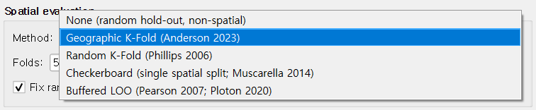

# ② Parameters tab

The Parameters tab controls the *modeling* and *evaluation* settings: which
Maxent feature classes to allow, the regularization multiplier, the spatial
cross-validation method, and where to write outputs. Defaults follow
established Maxent practice; this chapter explains what each control does
and when to override the default.

## Feature Types

Maxent's "features" are the basis functions it uses to express the response
of suitability to each environmental variable. The five classes (LQPHT) are:

| Feature | Symbol | What it captures |
|---|---|---|
| **Linear** | `bio1` | Monotonic linear response |
| **Quadratic** | `bio1²` | Optimum-shaped response |
| **Hinge** | `max(0, bio1 - threshold)` | Piecewise linear; very flexible |
| **Product** | `bio1 × bio7` | Pairwise interactions |
| **Threshold** | `1[bio1 > threshold]` | Step response |

### Auto (recommended)

The default. QMaxent uses the **maxnet auto-rule** — the same rule the R
`maxnet` package uses — to enable subsets of LQPHT based on the number of
presence points:

| Presence count | Features enabled |
|---|---|
| ≥ 80 | All five (LQPHT) |
| 15–79 | LQH (no Product or Threshold) |
| 10–14 | LQ |
| < 10 | L only |

This conservative scaling prevents overfitting on small datasets. For most
studies — including the 116-point Bradypus example — the default is exactly
what published practice recommends (Radosavljevic & Anderson 2014).

### Manual selection

Select **Manual selection** to enable / disable any combination of LQPHT
yourself. Useful when you want to:

- **Reproduce another publication** that used a specific feature subset.
- **Diagnose overfitting**: turning off Hinge and Threshold often produces
    smoother response curves at the cost of some AUC.
- **Run sensitivity analyses** to understand which feature classes drive
    your predictions.

## Regularization

Regularization controls how strongly Maxent shrinks coefficients toward
zero — directly trading variance for bias. The **multiplier** scales the
default regularization; values > 1 produce smoother, simpler models, values
< 1 fit more closely.

| Multiplier | Effect | When to use |
|---|---|---|
| **0.5** | More flexible, higher AUC, higher overfit risk | Only if you have a strong reason and a large CV-based sanity check |
| **1.0** *(default)* | Standard Maxent regularization | Most studies |
| **2.0–4.0** | Smoother responses, better extrapolation | Small datasets, projection across wide environmental gradients |

If you are unsure, leave it at 1.0 and check the cross-validated AUC. A
much-higher *training* AUC than *CV* AUC suggests overfitting and rewards
trying a larger multiplier.

## Advanced

| Control | Default | Notes |
|---|---|---|
| **Hinge knots** | 50 | Number of knot points for hinge features. Rarely needs changing. |
| **Threshold knots** | 50 | Same for threshold features. |
| **Add presences to background** | ✓ on | Following Phillips et al. (2017): including presences in the background sample is statistically the more correct formulation. |
| **Down-weight spatially clustered points** | off | Enable for surveys with strong spatial sampling bias (e.g. roadside observations). Implements the distance-weight bias correction from Phillips et al. (2009). |

## Spatial evaluation

This is the single most important academic decision in the dialog: how the
model's predictive performance is measured. QMaxent offers five methods.

| Method | Recommended for | Reference |
|---|---|---|
| **None** | Quick sanity checks only — no held-out evaluation | — |
| **Geographic K-Fold** *(default)* | General use; ≥ 25 presences | Anderson 2023 |
| **Random K-Fold** | Reproducing classic Maxent papers | Phillips 2006 |
| **Checkerboard** | Single deterministic split with spatial structure | Muscarella 2014 (ENMeval) |
| **Buffered LOO** | Small datasets (≤ 25 presences) | Pearson 2007; Ploton 2020 |

Why default to **Geographic K-Fold** rather than Random? When presences are
spatially autocorrelated — which is almost always — random folds let
training and test points sit next to each other and inflate AUC by a wide
margin (Roberts 2017). Geographic folds force test sets to be spatially
separated from training sets and yield much more honest performance
estimates. See [Methodological background](methodological-background.md) for
the deeper discussion.

### Folds, Grid size, Buffer, Fix random seed

These four numeric inputs are conditionally enabled depending on the chosen
method:

- **Folds**: how many splits for K-Fold methods. 5 (default) balances bias
    and variance for most datasets.
- **Grid size**: cell size for Checkerboard, in the rasters' units. Match it
    to the typical separation between presences.
- **Buffer**: exclusion radius around each held-out presence in Buffered
    LOO, in metres. 50 km is a sensible default for terrestrial vertebrates;
    use a finer or coarser value depending on dispersal distance.
- **Fix random seed** *(checkbox + value)*: enable for reproducibility.
    QMaxent uses the seed for fold construction and background sampling, so
    re-running with the same seed gives bitwise-identical results.

## Jackknife variable importance

When checked, QMaxent computes the standard Maxent jackknife: for each
variable it fits two extra models (with **only** that variable, and **without**
that variable) and reports the resulting AUCs. This produces the
characteristic per-variable bar plot (see [④ Results tab](results-tab.md))
and adds a Jackknife sheet to the results XLSX.

For models with many variables this multiplies training time roughly by
`2 × (number of variables) + 1`, but for the typical case of < 15 variables
the extra cost is small enough that we leave it on by default.

## Output Files

Two files are written when you run the model:

- **Model (.pkl)**: the serialized trained Maxent model (the elapid
    `MaxentModel` instance via Python pickle). Reload it from the
    [① Data tab](data-tab.md). See [Saving and reusing models](saving-models.md)
    for the security note on pickle.
- **Results XLSX**: a multi-sheet Excel workbook capturing experimental
    setup, variable inventory, cross-validation results, jackknife
    importance, and (if you run priority sites) the survey-planning output.
    Format follows the academic-paper Supplementary Table convention. See
    [Exporting results](exporting-results.md).

Both paths default to a `qmaxent_output` folder under your home directory,
but you can browse to any writeable location.
