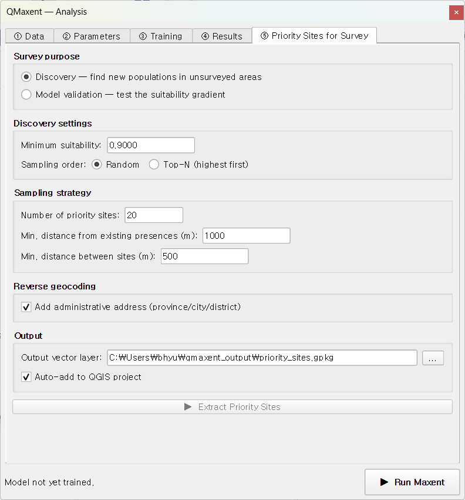

# ⑤ Priority Sites for Survey

The fifth tab turns a habitat-suitability raster into a **field-ready list
of candidate survey sites**. There are two distinct purposes — discovering
new populations versus validating the model — and QMaxent supports both
with separate sampling strategies.

## Survey purpose

Pick one:

| Mode | Goal | Reference |
|---|---|---|
| **Discovery** | Find new populations in unsurveyed areas | Williams et al. 2009 |
| **Model validation** | Test whether the suitability gradient predicts presence/absence | Rhoden, Peterman & Taylor 2017 |

The two modes ask very different questions of your model, so the rest of
the panel switches between two distinct configurations depending on which
purpose you choose.

## Discovery mode

Generates candidate sites where the trained model predicts **high
suitability** so field teams can target their search efficiently.

### Discovery settings

- **Minimum suitability**: the threshold below which cells are excluded
    from sampling. The default of 0.9000 is auto-set to *raster maximum
    × 0.9*, capturing only the most promising areas. Lower it (e.g. to 0.7)
    if you want a broader candidate pool.
- **Sampling order**:
    - **Random**: uniform random sampling within the high-suitability band.
        Use when you want spatial coverage of the candidate pool.
    - **Top-N (highest first)**: take the *N* highest-suitability cells.
        Use when you must visit only the very best sites.

### Sampling strategy

Three numerical controls shape the candidate set regardless of purpose:

- **Number of priority sites**: how many candidates to generate (default 20).
- **Min. distance from existing presences (m)**: forbids sampling within
    this radius of any presence point. Default 1,000 m. Increase if your
    presences are GPS-imprecise or you want to find genuinely new
    populations far from known ones.
- **Min. distance between sites (m)**: forbids sampling closer than this
    radius to any already-chosen candidate. Default 500 m. Spreads
    candidates across the high-suitability band rather than clustering them.

### Reverse geocoding

Tick **Add administrative address (province/city/district)** and QMaxent
queries [OpenStreetMap Nominatim](https://nominatim.openstreetmap.org/) to
add a human-readable address to each candidate. No API key required;
respects Nominatim's [usage policy](https://operations.osmfoundation.org/policies/nominatim/).
Geocoding ~20 sites takes 10–20 seconds.

## Model validation mode

Validation mode is intended for confirming or refuting the suitability
gradient with new fieldwork. Following Rhoden, Peterman & Taylor (2017), it
**stratifies sampling across four suitability quartiles** so each band gets
representative coverage in your survey design.

### Threshold methods

The lower bound of the lowest quartile must be set somehow. QMaxent offers
the standard methods:

| Method | Definition | Reference |
|---|---|---|
| **MTP** | *Minimum Training Presence* — the lowest suitability at any presence | Pearson et al. 2007 |
| **T10** | *10th-percentile Training Presence* — robust to a few outlier presences | — |
| **MaxSSS** | *Maximum Sum of Sensitivity and Specificity* — optimum threshold from the ROC | Liu, White & Newell 2013 |
| **Custom** | Pick any value yourself | — |

`MaxSSS` is recommended for validation purposes because it is the
threshold that maximises the model's discriminatory power. `MTP` is more
permissive and useful when even the lowest historically-occupied sites
carry biological meaning.

## Output

- **Output vector layer**: a GeoPackage (`.gpkg`) is written next to your
    other QMaxent outputs. Each candidate is a point with attributes
    `suitability`, `quartile` (validation mode), `min_distance_m`, and the
    Nominatim address fields if geocoding was enabled.
- **Auto-add to QGIS project** *(default on)*: the new layer is loaded with
    a default red-dot symbology so you can immediately see the candidates
    on top of the suitability map.

After running Discovery on the Bradypus model:

The status bar reports "20 priority sites extracted (MinSuit = 0.9000); 19/20
geocoded". One site failed geocoding because it fell over open ocean —
Nominatim does not have address records there.

The candidates appear on top of the suitability map:

## Tips for designing a survey

- **Pair a Discovery and a Validation run** when you have field budget for
    both. Discovery gives you new populations to confirm; Validation gives
    you the model accuracy estimate.
- **Override the auto-set Minimum suitability** if your study system's
    "high" is biologically different from the model's. For Bradypus a
    cloglog of 0.9 captures rainforest cores; for an alpine species you
    might tune it lower.
- **Use the spacing constraints** to ensure your survey trips can actually
    reach the sites. Default 500 m between sites is fine for road-accessible
    species; raise it for habitats that demand multi-day expeditions per site.
