# Quick start

This 5-minute walkthrough takes you from a freshly installed plugin to a
finished habitat-suitability map for *Bradypus variegatus*, the brown-throated
sloth — the same species the original Maxent paper used. Every screenshot in
this chapter shows real numbers from a run you can reproduce.

!!! tip "Prerequisites"
    Make sure you have completed [Installation](installation.md) and
    [Dependencies](dependencies.md) — the **QMaxent environment ready** banner
    must be green before continuing.

## Step 1 · Download the example dataset

Open **Plugins → QMaxent → Download Example Dataset**, choose
**Bradypus variegatus**, leave the default save location, and click
**Download**.

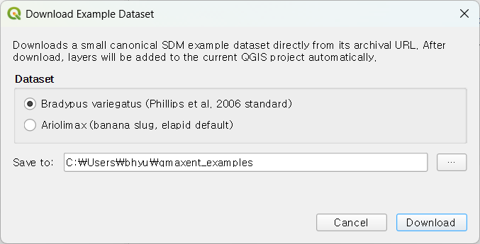

After a few seconds, the presence-point layer and nine environmental rasters
appear in your QGIS project:

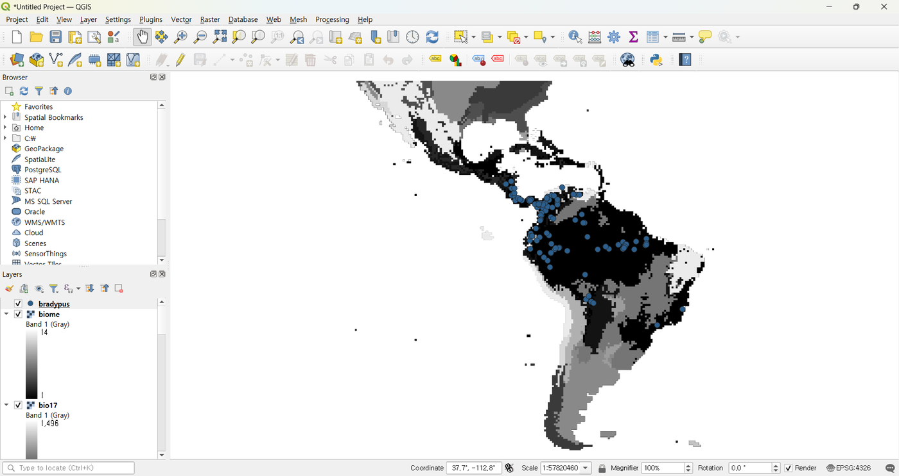

## Step 2 · Open the Analysis dock and load the data

Open **Plugins → QMaxent → QMaxent Analysis**. The dock has five numbered
tabs that you progress through in order. Start on **① Data** — choose
`bradypus` from the **Presence Points Layer** drop-down, then click
**Add from project** to add all the loaded raster layers in one step. Mark
`biome` as `[categorical]` so QMaxent treats it as a discrete factor rather
than a continuous variable.

Click **Check Raster Consistency**. The example data is already aligned, so
you get a green ✓:

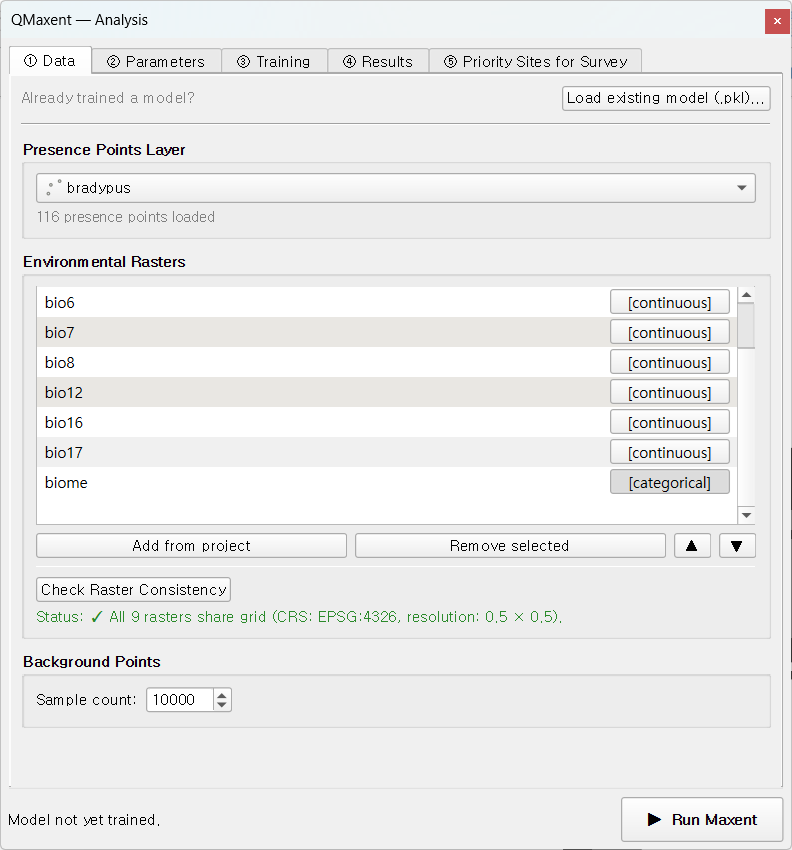

The status bar at the bottom of the dock now reports
`presence=116 background=10,113`.

## Step 3 · Accept the default parameters

Move to **② Parameters**. The defaults are deliberately chosen to be
publication-defensible for almost any first run: **Auto** feature selection
(maxnet rule), **regularization multiplier 1.0**, **Geographic K-Fold (k=5)**
spatial cross-validation, and **Jackknife variable importance** enabled.

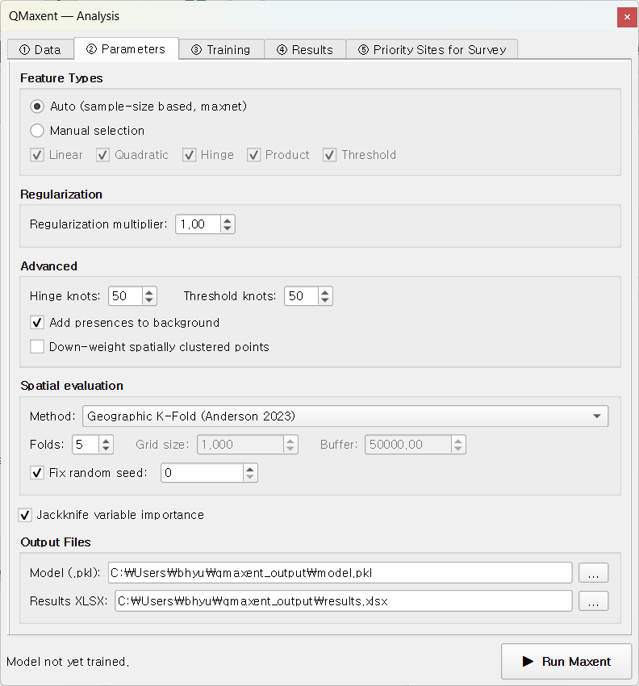

The Output Files section names a `.pkl` for the trained model and an `.xlsx`
for the publication-ready supplementary table. You can change these paths
later; for now leave them at their defaults.

## Step 4 · Run Maxent

Click the green **▶ Run Maxent** button at the bottom of the dock. Control
shifts to the **③ Training** tab where progress is reported live.

About 30 seconds later, the run completes:

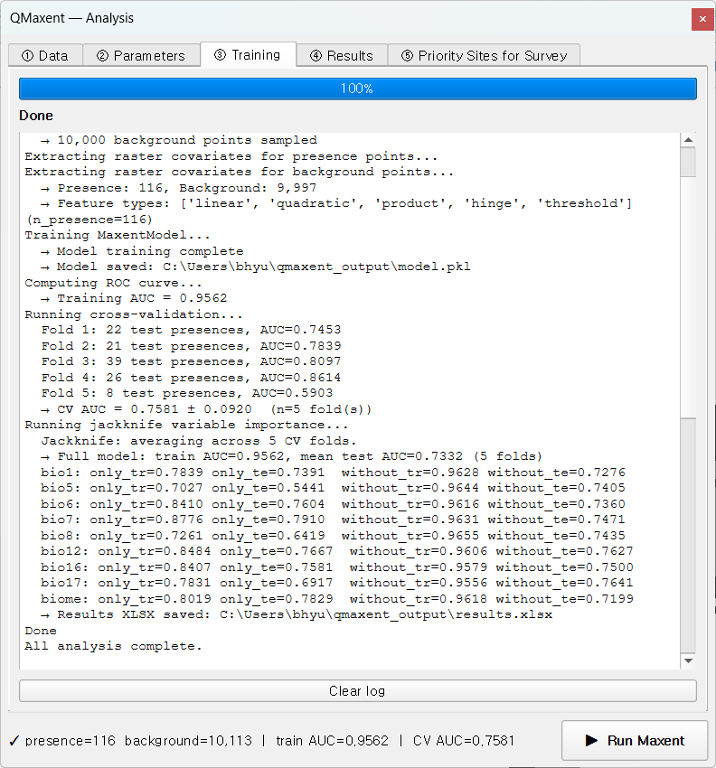

Read the log from top to bottom — it tells the whole story of the model:

- Background sampling and covariate extraction completed
- Feature types selected by the auto-rule: linear, quadratic, product, hinge, threshold
- **Training AUC = 0.9562** (within-sample fit)
- **CV AUC = 0.7581 ± 0.0920** across 5 spatial folds (held-out test performance)
- Jackknife results for each of the 9 variables

The status bar at the bottom of the dock now displays the headline numbers:
`train AUC=0.9562 · CV AUC=0.7581`.

## Step 5 · Inspect the results

The **④ Results** tab unlocks. Browse its three sub-tabs to understand what
the model learned.

### Response Curves

Pick a variable from the drop-down — here `bio1` (annual mean temperature):

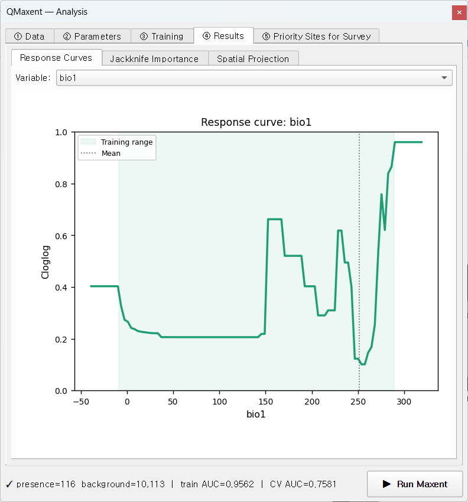

The shaded band marks the actual data range; predictions outside it are
extrapolations and should be interpreted cautiously.

### Jackknife Importance & ROC

The Jackknife sub-tab combines two diagnostics in a single view: the ROC
curve on the left (training and per-fold CV) and the Jackknife bars on the
right (model AUC with each variable alone vs. with each variable removed):

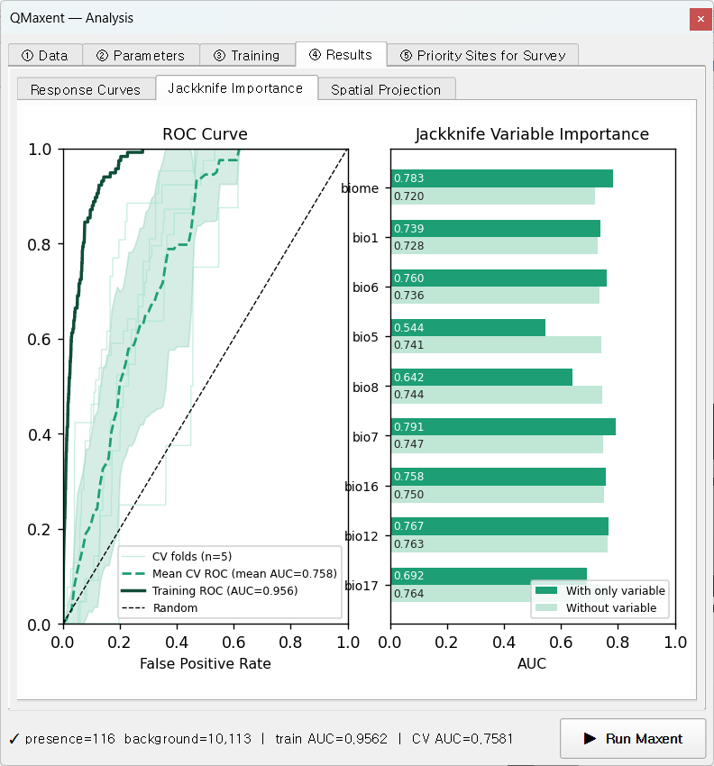

The mean CV ROC (dashed) sits well above the random diagonal, and the
jackknife bars show that `bio7`, `biome`, and `bio12` carry the most
information for this species.

### Spatial Projection

The Spatial Projection sub-tab applies the trained model to the full
environmental rasters to produce a habitat-suitability map. **cloglog** is
the recommended output transform (Phillips et al. 2017). Leave
**Auto-load result as QGIS layer** ticked and click **▶ Run Spatial
Projection**:

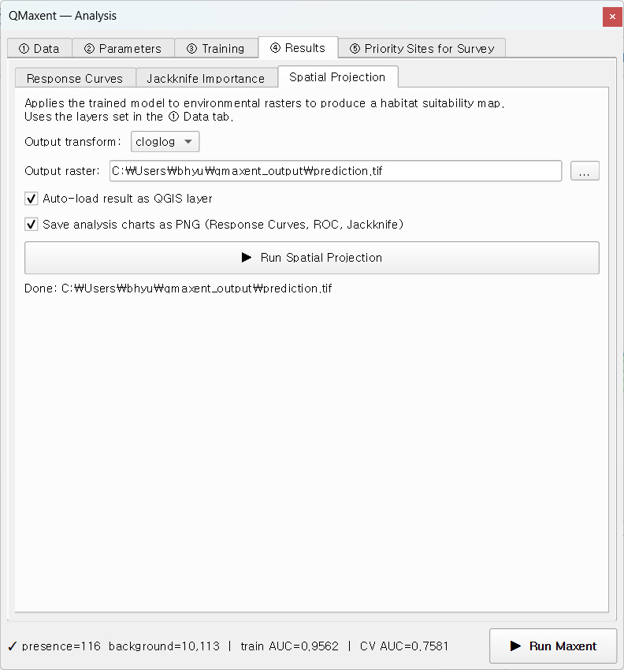

The resulting raster is added to QGIS automatically with a continuous
white-to-green ramp:

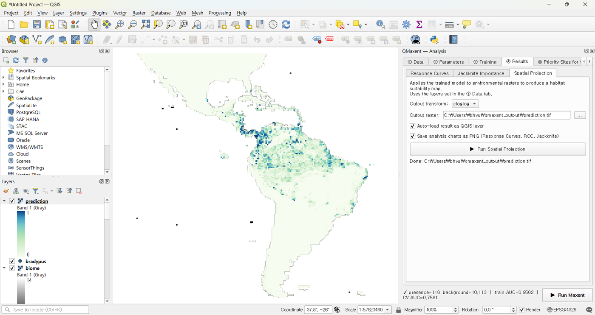

## Step 6 · Generate priority sites for survey *(optional)*

Move to **⑤ Priority Sites for Survey**. Pick **Discovery** mode (find new
populations) with a high `Minimum suitability` threshold (e.g. 0.9), set
**Number of priority sites** to 20, enable reverse geocoding, and click
**▶ Extract Priority Sites**:

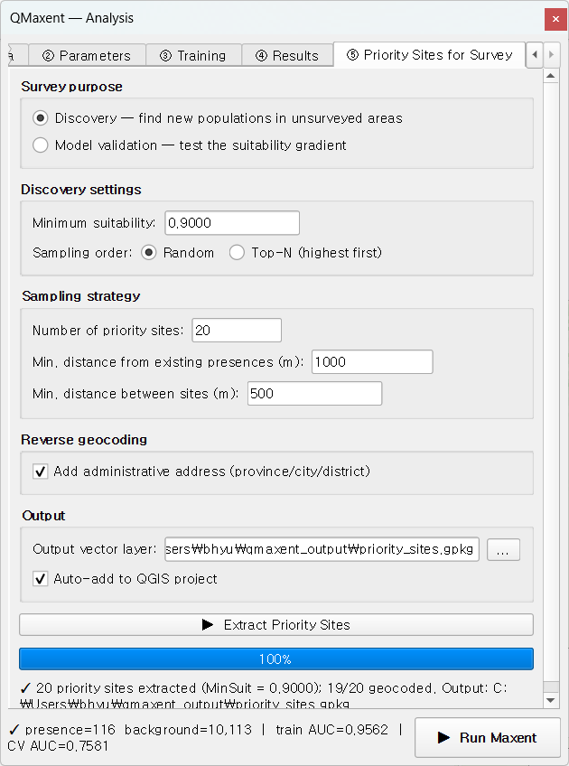

The candidate locations appear as red dots on the suitability map:

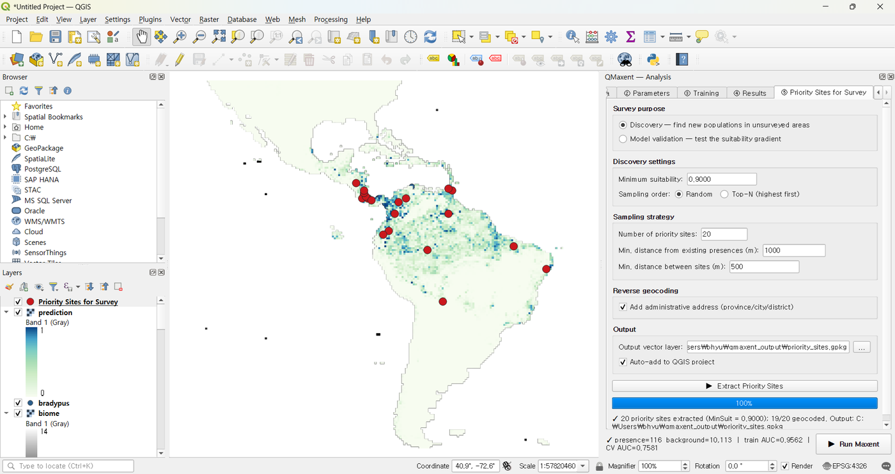

The output GeoPackage carries an attribute table with each site's coordinates,
suitability score, and (where Nominatim could resolve it) the administrative
address — ready to take into the field.

## Where to go next

Congratulations — you have just run a complete Maxent workflow. From here:

- **Reuse the trained model later** → [Saving and reusing models](saving-models.md)
- **Compile the results into a paper** → [Exporting results](exporting-results.md)
- **Understand the choices behind the defaults** → [Methodological background](methodological-background.md)
- **Try a more involved case study** → the [Worked examples](examples/index.md)
    chapter walks through Bradypus, Ariolimax, and Pitta nympha in depth.
