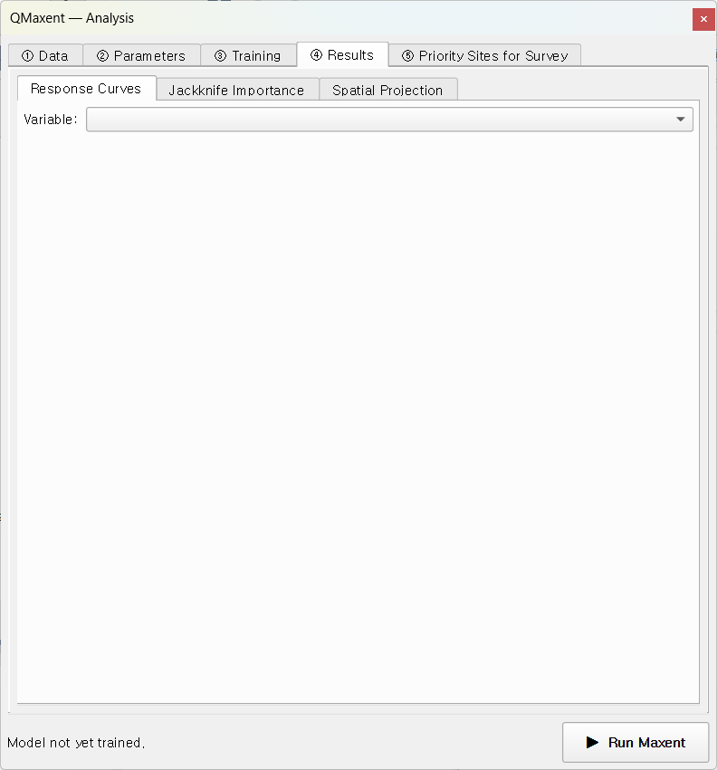
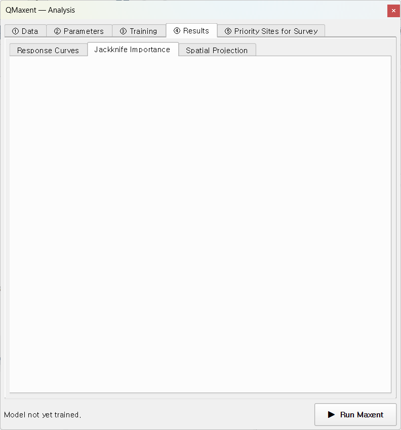
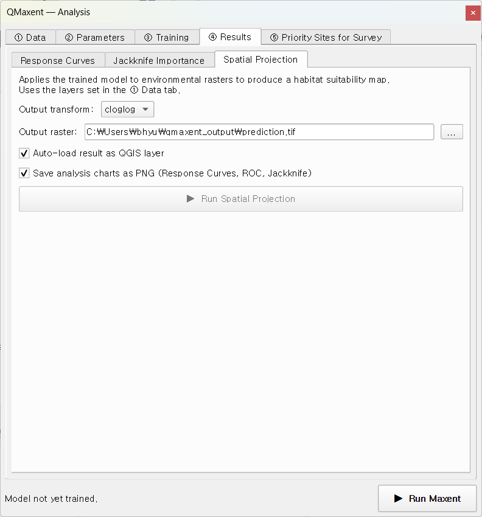

# ④ Results tab

After a successful run, the Results tab unlocks three sub-tabs:

| Sub-tab | What it shows |
|---|---|
| **Response Curves** | How each variable shapes predicted suitability across its data range |
| **Jackknife Importance** | Which variables matter most, with ROC plotted alongside |
| **Spatial Projection** | Write the prediction to a GeoTIFF and load it as a styled QGIS layer |

## Response Curves

Pick a variable from the drop-down at the top. QMaxent draws the predicted
cloglog suitability across the variable's actual training range (shaded
band) with the mean as a vertical reference line:

For continuous variables the curve is a marginal-effect plot in the sense
of [Elith et al. 2011](references.md): suitability is computed at the
sweep of values for the focal variable while every other variable is held
at its mean (or, for categoricals, its modal level).

For categorical variables, QMaxent renders a bar chart with one bar per
class, ordered by predicted suitability — visually clearer than the
ramped curve a Java-MaxEnt run would produce.

The shaded **Training range** band is important: predictions outside this
band are pure extrapolation. Whenever your eventual spatial projection
reaches values outside the band, QMaxent shows a one-off
[Multivariate Environmental Similarity Surface](#)-style warning (see
[Elith, Kearney & Phillips 2010](references.md)) before writing the
output GeoTIFF.

The grid view across all variables is the standard
[Phillips et al. 2006](references.md) summary plot used in publications.
QMaxent saves it as `prediction_response_curves.png` (300 dpi) when the
**Save analysis charts as PNG** checkbox is on at projection time — see
[Exporting results](exporting-results.md).

## Jackknife Importance

This sub-tab combines the ROC curve and per-variable Jackknife bars in a
single panel — the canonical Maxent figure since
[Phillips, Anderson & Schapire 2006](references.md):

**Reading the ROC panel:**

- **Training ROC** (solid) — in-sample fit
- **Mean CV ROC** (dashed) — across-fold mean of held-out folds
- **Per-fold ROC** (faint) — variance across folds is the model's
  spatial sub-sample stability

**Reading the Jackknife bars:**

- **With-only** (dark) — AUC of a model fit on this variable alone
- **Without** (light) — AUC of the full model with this variable removed
- A variable with a high *with-only* and a high *without* drop carries
  a unique signal not redundant with the others (the most informative kind).

The bars are sorted by **Test AUC drop** by default. The same numbers are
exported into Table 4 of the XLSX — see
[Exporting results](exporting-results.md) for the sheet layout.

## Spatial Projection

The third sub-tab projects the trained model across all the input rasters,
producing a habitat-suitability GeoTIFF.

Controls:

- **Output transform**:
  - `cloglog` (default) — interpretable as probability of presence
    given a typical sample of the species, the form
    [Phillips et al. 2017](references.md) recommend as the new default.
  - `logistic` — the older ([Phillips & Dudík 2008](references.md))
    parameterisation; still used in some published baselines.
  - `raw` — the unnormalised exponential output, mostly useful for
    advanced post-processing.
- **Auto-load result as QGIS layer** (default on) — the GeoTIFF appears
  on the canvas with a default white-to-green ramp.
- **Save analysis charts as PNG** — when on, three additional 300-dpi
  PNGs (ROC, Jackknife, response-curve grid) are written next to the
  GeoTIFF. Sized for direct paste into a single-column manuscript figure.

### The unified preflight dialog

Before writing the projection, QMaxent runs **two safety checks** in a
single combined dialog:

1. **Categorical-code coverage** — any class code present in the
   projection rasters but unseen during training is auto-masked to NoData
   (rather than silently extrapolated to a random class probability).
2. **Continuous-variable extrapolation** — if any continuous variable's
   projection range exceeds its training range
   ([Elith, Kearney & Phillips 2010](references.md)), the dialog reports
   the affected variables and the magnitude of the excursion.

Click **Yes** to proceed; **No** aborts the projection so you can revise
the input rasters.

### After the projection

A success message appears in the panel:

The GeoTIFF is loaded into QGIS with a default white-to-green ramp keyed
to the cloglog 0–1 range, ready to compose into a publication map.

## Next

Move to the [⑤ Priority Sites for Survey tab](priority-sites.md) to turn
the suitability raster into a field-ready candidate point layer, or skip
ahead to [Exporting results](exporting-results.md) to learn what is in
the output workbook.
