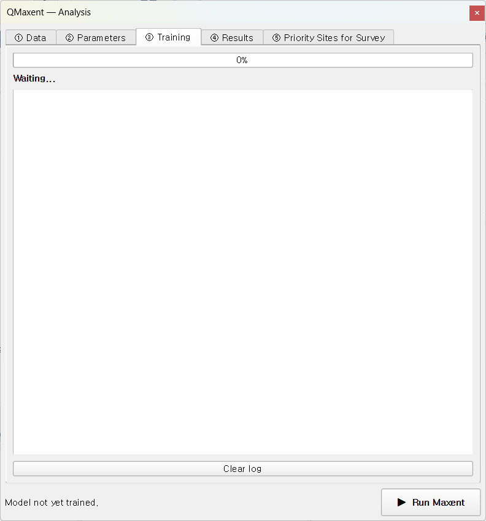
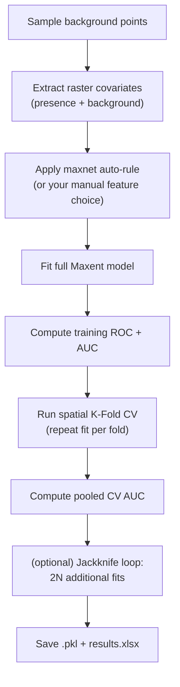

# ③ Training tab

When you click **▶ Run Maxent** at the bottom of the dock, focus shifts to
the Training tab. A progress bar shows fold-by-fold progress and a log
panel records what the model is doing in real time — useful for diagnosing
slow runs, oversized rasters, or convergence issues.



## What happens when you click Run

QMaxent runs the following pipeline; each step writes a status line to the
log:



The fit is performed by
[elapid](https://github.com/earth-chris/elapid)'s `MaxentModel`, a faithful
Python port of the original Java MaxEnt
([Phillips et al. 2006](references.md);
[Phillips et al. 2017](references.md)) that delegates the regularized
likelihood maximisation to scikit-learn
([Pedregosa et al. 2011](references.md)). The result is numerically very
close to Java MaxEnt for identical inputs and identical hyperparameters
— the residual difference comes mostly from how each implementation
handles ties in the optimisation step.

## Reading the log

A typical successful run produces a log like:

```text
→ 10,000 background points sampled
Extracting raster covariates for presence points…
Extracting raster covariates for background points…
→ Presence: 116, Background: 9,997
→ Feature types: ['linear', 'quadratic', 'product', 'hinge', 'threshold']
Training MaxentModel…
→ Model training complete
→ Model saved: …/model.pkl
Computing ROC curve…
→ Training AUC = 0.9562
Running cross-validation…
  Fold 1: 22 test presences, AUC = 0.7453
  Fold 2: 21 test presences, AUC = 0.7839
  Fold 3: 39 test presences, AUC = 0.8097
  Fold 4: 26 test presences, AUC = 0.8614
  Fold 5:  8 test presences, AUC = 0.5903
→ CV AUC = 0.7581 ± 0.0920  (n=5 fold(s))
```

A few patterns to recognise:

- **Background = 9,997 instead of 10,000** — points that fell on
  NoData cells were dropped. Normal and not a cause for concern unless
  the loss is large (>5 %).
- **Per-fold AUC well below the mean** — for example Fold 5 above
  (AUC = 0.59 with only 8 presences). Geographic K-Fold deliberately
  produces uneven folds, and a small fold can land on an atypical region
  of the study area. The pooled mean smooths this out.
- **Train AUC ≫ CV AUC** — the spatial-CV gap. A *good* sign in the
  sense that it tells you the model has not been silently over-fitted to
  the training presences ([Roberts et al. 2017](references.md)). A train
  AUC of 0.95 with a CV AUC of 0.55 is the warning sign — the CV is
  telling you the model does not generalise.

## Completion

When the run finishes, you see the green **Done** state:


The dock's footer status bar populates with `train AUC=… CV AUC=…` and the
**④ Results** tab unlocks.

## Cancelling a run

Click **Cancel** to abort. QMaxent terminates the current fold cleanly,
discards the in-memory model, and leaves disk outputs untouched. You can
restart by clicking **▶ Run Maxent** again.

## Common warnings

| Message | Meaning | Action |
|---|---|---|
| `⚠ Removed 312 presences with NoData covariate values` | Some points fell on NoData cells | Inspect the raster stack; may indicate the wrong CRS or a clipped raster |
| `⚠ Background points cap reduced from 10,000 to N` | Study area too small for the requested background size | Reduce the background-points field on Data tab |
| `⚠ Convergence not reached after 500 iterations` | Hard-to-fit model (often very few presences) | Increase the regularization multiplier or simplify the feature set |

## Next

Move to the [④ Results tab](results-tab.md) to inspect response curves,
Jackknife importance, and run a spatial projection.
