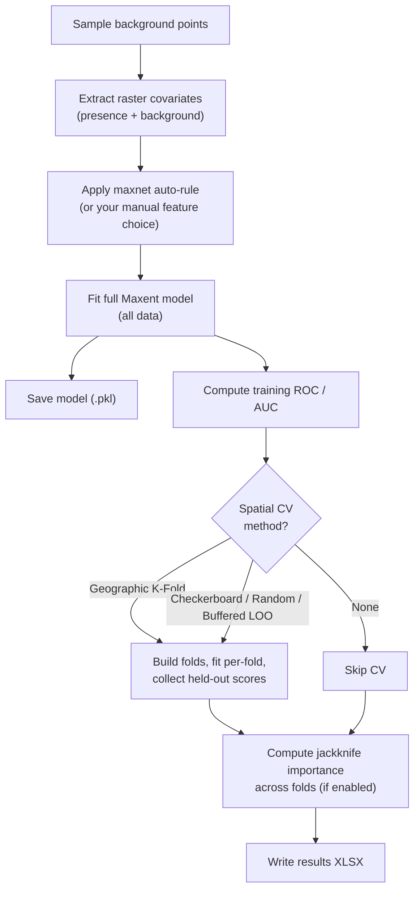

# ③ Training tab

When you click **▶ Run Maxent** at the bottom of the dock, focus shifts to
the Training tab. A progress bar shows fold-by-fold progress and a log
panel records what the model is doing in real time — useful for diagnosing
slow runs, oversized rasters, or convergence issues.

## What happens when you click Run

QMaxent runs the following pipeline; each step writes a status line to the
log:

The whole pipeline typically completes in **15–60 seconds** on a modern
laptop for a moderately sized dataset (~100 presences, 10 rasters, 10,000
background points). Larger datasets scale roughly linearly with presence
count.

## Progress bar

The bar at the top reports overall pipeline progress (0–100 %). Major
milestones — full-model fit, each CV fold, jackknife pass — each advance
the bar a measurable amount, so you can tell at a glance whether the run is
healthy.

## Training log

Below the progress bar, the log panel records every step. After a successful
Bradypus run it looks like this:

Read the log top-down — it is the most complete record of what happened in
the run. From the screenshot:

- `→ 10,000 background points sampled` — sampling completed
- `→ Presence: 116, Background: 9,997` — final counts (slightly under the
    request because of NaN cells)
- `→ Feature types: ['linear', 'quadratic', 'product', 'hinge', 'threshold']`
    — the auto-rule chose all five LQPHT for n = 116
- `→ Training AUC = 0.9562`
- Per-fold CV AUCs (5 folds, ranging 0.59 – 0.86)
- `→ CV AUC = 0.7581 ± 0.0920` — mean ± standard deviation across folds
- Jackknife block: `only_tr / only_te / without_tr / without_te` for each of
    the 9 variables
- `→ Results XLSX saved: …` — final artifact location

The same headline numbers (`train AUC=0.9562`, `CV AUC=0.7581`) are echoed
in the dock's permanent status bar so they remain visible after you switch
tabs.

## Common warnings and what they mean

| Log message | Meaning | What to do |
|---|---|---|
| `Some background points overlap presences (n=…)` | Expected with *Add presences to background* on. Just a count, not an error. | Ignore unless n is very large |
| `Categorical variable has only one level in fold k` | One CV fold ended up with no variation in a categorical raster | Use a coarser categorical scheme, or switch CV method |
| `Failed to converge after 200 iterations` | Numerical issue, usually caused by collinear variables | Drop the most collinear pair (correlation matrix in the XLSX helps) |
| `Some rasters have NaN cells inside the study extent` | Missing-data cells were excluded | Confirm your study area mask is intentional |

## Cancelling a run

The QGIS task manager (bottom of the QGIS main window) lists the QMaxent
training task. Use its **Cancel** button to abort. Partial outputs are not
written.

## Clear log button

The **Clear log** button at the bottom of the panel wipes the log text. The
saved `.pkl` and XLSX are not affected. This is just a convenience for
multi-run sessions where you want a clean slate before the next experiment.
